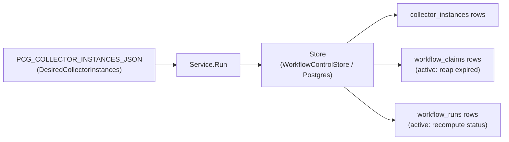
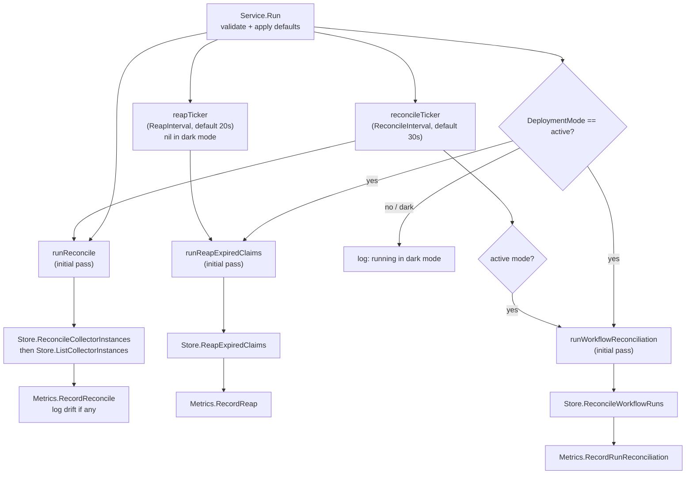

# Coordinator

## Purpose

`internal/coordinator` owns the workflow coordinator's reconcile, expired-claim
reap, and workflow-run reconciliation loops. `Service.Run` ticks through three
discrete operations — collector-instance reconciliation (always), expired-claim
reaping (active mode only), and workflow-run progress reconciliation (active
mode only) — against a narrow `Store` interface backed by Postgres. The package
also owns `PCG_WORKFLOW_COORDINATOR_*` env parsing and OTEL instrument
registration for the coordinator.

## Where this fits in the pipeline

## Internal flow

## Lifecycle

`Service.Run` performs an initial synchronous pass for all enabled operations,
then enters a `select` loop. The `reconcileTicker` fires `runReconcile` (and
`runWorkflowReconciliation` in active mode) on every tick. The `reapTicker` is
nil in dark mode — `tickerChan(nil)` returns a nil channel the `select` never
picks. Context cancellation (`ctx.Done`) exits the loop cleanly.

`Config.Validate` runs at `LoadConfig` time and again at `Service.Run` entry.
Defaults are applied by `withDefaults` before validation, so missing env vars
fall back to defaults rather than failing; malformed values fail fast.

`Service.Clock` is a testable time source. Production wiring leaves it nil;
`now()` falls back to `time.Now()`.

## Exported surface

- `Store` — the narrow durable interface `Service` depends on:
  `ReconcileCollectorInstances`, `ListCollectorInstances`,
  `ReapExpiredClaims`, `ReconcileWorkflowRuns`. Implemented by
  `storage/postgres.WorkflowControlStore`.
- `Service` — the long-running loop; wire `Config`, `Store`, `Metrics`, and
  `Logger` then call `Service.Run`.
- `Config` — runtime settings: `DeploymentMode`, `ClaimsEnabled`,
  `ReconcileInterval`, `ReapInterval`, `ClaimLeaseTTL`, `HeartbeatInterval`,
  `ExpiredClaimLimit`, `ExpiredClaimRequeueDelay`, `CollectorInstances`.
- `LoadConfig(getenv)` — parses all `PCG_WORKFLOW_COORDINATOR_*` and
  `PCG_COLLECTOR_INSTANCES_JSON` env vars into a validated `Config`.
- `Metrics` — recording interface: `RecordReconcile`, `RecordReap`,
  `RecordRunReconciliation`.
- `NewMetrics(meter)` — registers OTEL counters, histograms, and observable
  gauges against the `pcg_dp_workflow_coordinator_` prefix.
- `ReconcileObservation`, `ReapObservation`, `RunReconciliationObservation` —
  value types passed to `Metrics` recording methods.

## Dependencies

- `internal/workflow` — `DesiredCollectorInstance`, `CollectorInstance`,
  `Claim`, and default accessors; used throughout `Store` and `Config`.
- `internal/scope` — `CollectorKind` used by `Config` and
  `DesiredCollectorInstance`.
- `internal/telemetry` — `MetricDimensionOutcome` attribute key used in
  `otelMetrics`.

## Telemetry

OTEL instruments registered under `pcg_dp_workflow_coordinator_`:

| Instrument | Kind | Description |
|---|---|---|
| `reconcile_total` | counter | reconcile-loop executions labeled by `outcome` |
| `reconcile_duration_seconds` | histogram | reconcile-loop wall time |
| `reap_total` | counter | expired-claim reap passes labeled by `outcome` |
| `reap_duration_seconds` | histogram | reap-pass wall time |
| `run_reconcile_total` | counter | workflow-run reconciliation passes labeled by `outcome` |
| `run_reconcile_duration_seconds` | histogram | run-reconciliation wall time |
| `desired_collector_instances` | gauge | count from `Config.CollectorInstances` |
| `durable_collector_instances` | gauge | count returned by `Store.ListCollectorInstances` |
| `collector_instance_drift` | gauge | absolute difference between desired and durable |
| `last_reaped_claims` | gauge | claims reaped in the most recent pass |
| `last_reconciled_runs` | gauge | runs recomputed in the most recent pass |

Outcome labels: `success`, `reconcile_error`, `state_read_error` for reconcile;
`success` and `error` for reap and run-reconcile.

Structured log events: startup mode message (info), collector instance drift
warning (`collector_instance_drift_detected`, fields
`desired_collector_instances`, `durable_collector_instances`,
`collector_instance_drift`).

## Operational notes

- `pcg_dp_workflow_coordinator_collector_instance_drift > 0` means the desired
  collector-instance set is not fully durable. Check Postgres connectivity and
  structured log warnings before concluding the config is wrong.
- `pcg_dp_workflow_coordinator_reconcile_total{outcome="reconcile_error"}` or
  `{outcome="state_read_error"}` rising means the Postgres store is unavailable
  or returning errors. Check `pcg_dp_postgres_query_duration_seconds`.
- `pcg_dp_workflow_coordinator_reap_total` and
  `pcg_dp_workflow_coordinator_run_reconcile_total` are zero in dark mode.
  Confirm `PCG_WORKFLOW_COORDINATOR_DEPLOYMENT_MODE=active` before
  investigating metric absence.
- `last_reaped_claims` spiking above `ExpiredClaimLimit` is not possible; that
  limit caps each reap pass. Repeated spikes at the limit indicate collectors
  are not completing claims within the lease TTL.

## Extension points

- `Store` — substitute any implementation satisfying the four-method interface
  for testing or future backends.
- `Metrics` — `NewMetrics` is the OTEL implementation; a nil or recording stub
  works for isolated tests. `Service` guards all metric calls with nil checks.
- `Service.Clock` — inject a custom clock for deterministic time-based tests.

## Gotchas / invariants

- `Config.Validate` rejects active mode without `ClaimsEnabled=true` and at
  least one enabled claim-capable collector instance. The binary exits if this
  is violated.
- `HeartbeatInterval` must be strictly less than `ClaimLeaseTTL` or
  `Validate` returns an error.
- The reap ticker is nil in dark mode. `tickerChan(nil)` returns a nil channel
  that the `select` ignores — this is intentional and correct.
- `Metrics.RecordReap` and `Metrics.RecordRunReconciliation` are accessed via
  interface type assertions in `recordReap` and `recordRunReconciliation`
  because `Metrics` only declares `RecordReconcile`. If the wired `Metrics`
  does not implement the broader interface the recording calls are silently
  skipped. `otelMetrics` (returned by `NewMetrics`) implements all three.
- This package does not normalize triggers, schedule runs, or own permanent
  claim assignments. Those capabilities are not implemented here today.

## Related docs

- `docs/docs/deployment/service-runtimes.md`
- `docs/docs/reference/telemetry/index.md`
- `go/internal/workflow/README.md`
- `go/cmd/workflow-coordinator/README.md`
