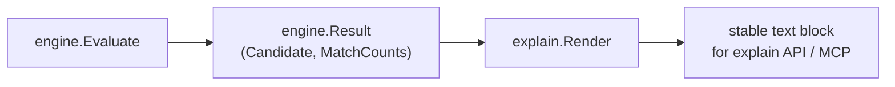

# Correlation Explain

## Purpose

`correlation/explain` formats one engine.Result as a stable, line-oriented
text block for the explain API and operator-facing diagnostics. It renders the
candidate header, sorted match-count lines, sorted rejection-reason lines, and
sorted evidence lines in a deterministic order so explain output is comparable
across runs and replay-stable.

## Where this fits in the pipeline

`Render` is called after evaluation is complete. It does not re-evaluate rules
or re-apply admission.

## Ownership boundary

- Owns: the text format and sort order of explain output.
- Does not own: evaluation, admission, or candidate identity. The engine must
  have already decided the candidate's state and reasons before `Render` is
  called.

## Internal flow

`Render` (`explain.go:13`) builds lines in a fixed order:

1. Header line:
   `candidate=<ID> kind=<Kind> key=<CorrelationKey> state=<State> confidence=<%.2f>`
2. Match-count lines: sorted by rule name ascending using `slices.Sort`; emitted
   only for keys present in the result's match counts.
3. Rejection-reason lines: sorted alphabetically using `slices.Sort`.
4. Evidence lines: evidence is cloned and sorted by
   `(ID ascending, SourceSystem ascending, EvidenceType ascending)` using
   `slices.SortFunc` with `compareEvidence` (`explain.go:63`).

Lines are joined by `\n`; there is no trailing newline.

## Exported surface

- `Render(result engine.Result) string` — returns a stable text block for one
  evaluated candidate. The output format and sort order are part of the public
  contract.

See `doc.go` for the godoc contract.

## Dependencies

- `correlation/engine` — engine.Result shape (provides candidate and match counts).
- `correlation/model` — evidence atom for evidence line rendering.
- Standard library: `fmt`, `slices`, `strings`.

## Telemetry

None.

## Gotchas / invariants

- **DETERMINISM: line order** — header first, then match-count lines sorted by
  rule name, then rejection-reason lines sorted alphabetically, then evidence
  lines sorted by `(ID, SourceSystem, EvidenceType)`. This order is part of
  the public contract; golden tests and explain API consumers depend on it.
- **DETERMINISM: evidence sort** — each `EvidenceAtom` in the evidence slice is
  cloned and sorted using `compareEvidence` at `explain.go:63`. Sort key: ID
  first, then SourceSystem, then EvidenceType. The clone prevents mutation of
  the input result.
- **Confidence precision** — `Render` formats confidence to two decimal places
  (`%.2f` at `explain.go:21`). Callers needing higher precision must format
  confidence outside `Render`.
- **Match-count lines are conditional** — a match-count line appears only when
  its rule name is a key in the result's match counts. The engine populates
  match counts only for match-kind rules; non-match rules produce no
  match-count line.
- **No trailing newline** — `strings.Join(lines, "\n")` does not append a
  final `\n`. Callers that write output to a terminal may want to append one.
- **Evidence value is rendered verbatim** — `renderEvidence` at `explain.go:51`
  formats each `EvidenceAtom` value without quoting or escaping.
  Values containing spaces produce lines that may be ambiguous to parsers
  expecting space-delimited key=value pairs.

## Related docs

- `go/internal/correlation/engine/README.md` — produces the result that
  `Render` consumes
- `go/internal/correlation/model/README.md` — evidence atom field names used
  in rendered output
- `go/internal/correlation/README.md` — pipeline overview
- ADR: `docs/docs/adrs/2026-04-19-deployable-unit-correlation-and-materialization-framework.md`
