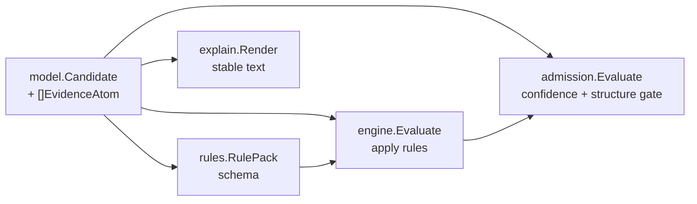

# Correlation Model

## Purpose

`correlation/model` defines the shared types that every correlation
sub-package imports: `Candidate`, `EvidenceAtom`, `CandidateState`,
`RejectionReason`, and their `Validate` methods. Rules, engine, admission,
and explain all depend on these types to agree on the same identity, state
machine, and confidence contract.

## Where this fits in the pipeline

`model` is the dependency foundation. All other correlation packages import
it; it imports only the standard library.

## Ownership boundary

- Owns: `Candidate`, `EvidenceAtom`, `CandidateState`, `RejectionReason`,
  and their `Validate` methods.
- Does not own: rule schemas (`rules`), evaluation flow (`engine`), gating
  logic (`admission`), or rendering (`explain`).

## Exported surface

States:

- `CandidateState` — `CandidateStateProvisional`, `CandidateStateAdmitted`,
  `CandidateStateRejected`. `Validate()` rejects unknown values.

Rejection reasons:

- `RejectionReason` — `RejectionReasonLowConfidence`,
  `RejectionReasonStructuralMismatch`, `RejectionReasonLostTieBreak`.

Core types:

- `EvidenceAtom` — one normalized evidence record: `ID`, `SourceSystem`,
  `EvidenceType`, `ScopeID`, `Key`, `Value`, `Confidence`. `Validate()`
  requires non-blank `ID`, `SourceSystem`, `EvidenceType`, `ScopeID`, `Key`,
  and `Confidence` in `[0, 1]`. `Value` has no non-blank constraint.
- `Candidate` — one correlation candidate: `ID`, `Kind`, `CorrelationKey`,
  `Confidence`, `State`, `Evidence`, `RejectionReasons`. `Validate()` requires
  non-blank `ID`, `Kind`, `CorrelationKey`; `Confidence` in `[0, 1]`; valid
  `State`; all `Evidence` atoms valid.

See `doc.go` for the godoc contract.

## Dependencies

Standard library only (`fmt`, `strings`).

## Telemetry

None. Pure data types.

## Gotchas / invariants

- `Confidence` on both `Candidate` and `EvidenceAtom` must be in `[0, 1]`.
  `Validate()` enforces this at `types.go:78` (candidate) and `types.go:106`
  (evidence atom). Out-of-range values return an error.
- `CandidateStateProvisional` is the initial state before evaluation. The
  engine must not return provisional candidates as final results. If a
  provisional candidate appears in an `engine.Evaluation`, it signals a
  pipeline bug.
- `RejectionReasons` is a slice; a candidate can accumulate multiple reasons.
  `RejectionReasonLowConfidence` and `RejectionReasonStructuralMismatch` are
  appended by `engine.Evaluate` after consulting `admission.Evaluate`.
  `RejectionReasonLostTieBreak` is appended by the engine's tie-break pass.
- `Validate` trims whitespace when checking required string fields
  (`types.go:66-74`). A field containing only spaces is treated as blank.
- `EvidenceAtom.Value` is the only field with no non-blank constraint. It is
  an optional qualifier and may be empty.

## Related docs

- `go/internal/correlation/README.md` — root package and pipeline overview
- `go/internal/correlation/admission/README.md` — uses `Candidate` and
  `EvidenceAtom` for gate checks
- `go/internal/correlation/engine/README.md` — consumes and mutates
  `CandidateState` and `RejectionReasons`
- ADR: `docs/docs/adrs/2026-04-19-deployable-unit-correlation-and-materialization-framework.md`
