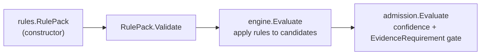

# Correlation Rules

## Purpose

`correlation/rules` defines the declarative rule-pack schema and the eleven
first-party rule packs PCG ships for container, IaC, and CI/CD correlation
families. The engine consumes these packs verbatim; the rules package owns no
evaluation logic, only schema definition and pack constructors.

## Where this fits in the pipeline

`rules` feeds the engine. It has no runtime state and no dependencies outside
the standard library.

## Ownership boundary

- Owns: `RuleKind`, `EvidenceField`, `EvidenceSelector`,
  `EvidenceRequirement`, `Rule`, `RulePack`, and the per-family pack
  constructors.
- Does not own: candidate evaluation (`engine`), admission gating
  (`admission`), explain rendering (`explain`), or candidate types (`model`).

## Exported surface

Schema types (all in `schema.go`):

- `RuleKind` — `RuleKindExtractKey`, `RuleKindMatch`, `RuleKindAdmit`,
  `RuleKindDerive`, `RuleKindExplain`. `Validate()` rejects unknown values.
- `EvidenceField` — `EvidenceFieldSourceSystem`, `EvidenceFieldEvidenceType`,
  `EvidenceFieldScopeID`, `EvidenceFieldKey`, `EvidenceFieldValue`.
  `Validate()` rejects unknown values.
- `EvidenceSelector` — `Field EvidenceField`, `Value string`. `Validate()`
  requires a non-blank `Value`.
- `EvidenceRequirement` — `Name`, `MinCount`, `MatchAll []EvidenceSelector`.
  `Validate()` requires non-blank `Name`, positive `MinCount`, and at least
  one selector.
- `Rule` — `Name`, `Kind RuleKind`, `Priority`, `MaxMatches`. Engine sorts by
  `(Priority ascending, Name ascending)`.
- `RulePack` — `Name`, `MinAdmissionConfidence`, `RequiredEvidence`, `Rules`.
  `Validate()` requires `MinAdmissionConfidence` in `[0, 1]`, at least one
  rule, non-blank names, valid kinds, non-negative `Priority` and `MaxMatches`.

First-party pack constructors (one per file):

- `AnsibleRulePack` — pack name `ansible`, `MinAdmissionConfidence` 0.76
- `ArgoCDRulePack` — pack name `argocd`, `MinAdmissionConfidence` 0.90
- `CloudFormationRulePack` — pack name `cloudformation`,
  `MinAdmissionConfidence` 0.79
- `DockerComposeRulePack` — pack name `docker_compose`,
  `MinAdmissionConfidence` 0.80
- `DockerfileRulePack` — pack name `dockerfile`, `MinAdmissionConfidence` 0.90
- `GitHubActionsRulePack` — pack name `github_actions`,
  `MinAdmissionConfidence` 0.82
- `HelmRulePack` — pack name `helm`, `MinAdmissionConfidence` 0.86
- `JenkinsRulePack` — pack name `jenkins`, `MinAdmissionConfidence` 0.84
- `KustomizeRulePack` — pack name `kustomize`, `MinAdmissionConfidence` 0.83
- `TerraformConfigRulePack` — pack name `terraform_config`,
  `MinAdmissionConfidence` 0.91
- `TerragruntRulePack` — pack name `terragrunt`, `MinAdmissionConfidence` 0.76

Aggregated entry points (in `container_rulepacks.go`):

- `ContainerRulePacks()` — returns the initial container correlation slice:
  `DockerfileRulePack`, `DockerComposeRulePack`, `GitHubActionsRulePack`,
  `JenkinsRulePack`, `HelmRulePack`, `ArgoCDRulePack`, `KustomizeRulePack`,
  `TerraformConfigRulePack`, `CloudFormationRulePack` (9 packs; excludes
  `TerragruntRulePack` and `AnsibleRulePack`).
- `FirstPartyRulePacks()` — returns all 11 shipped packs; adds
  `TerragruntRulePack` and `AnsibleRulePack` to the container slice.

See `doc.go` for the godoc contract.

## Dependencies

Standard library only (`fmt`, `strings`).

## Telemetry

None. Schema and constructors only.

## Gotchas / invariants

- `RulePack.Validate` requires `MinAdmissionConfidence` in `[0, 1]`, at least
  one `Rule`, non-blank rule names, valid `RuleKind`, non-negative `Priority`,
  and non-negative `MaxMatches` (`schema.go:109`).
- `EvidenceRequirement.MinCount` must be positive (strictly `> 0`) and
  `MatchAll` must contain at least one selector (`schema.go:90`). `Validate`
  rejects whitespace-only selector `Value` strings.
- `MatchAll` semantics in `EvidenceRequirement`: ALL selectors must match a
  single evidence atom for it to count toward `MinCount`. One failing selector
  disqualifies the whole atom.
- `MaxMatches = 0` is treated by the engine as unbounded: when `MaxMatches <= 0`
  the engine uses the full evidence count. A value of 0 does not mean "disallow matches."
- `ContainerRulePacks` and `FirstPartyRulePacks` return different sets. Do
  not assume callers use the same slice. `ContainerRulePacks` excludes
  `TerragruntRulePack` and `AnsibleRulePack`.
- Pack constructors return value types, not pointers. Each call produces a
  fresh independent pack.

## Extension points

- Add a new pack by implementing a new constructor function (one per file,
  matching the pattern of existing files) and adding it to
  `FirstPartyRulePacks` and, if appropriate, `ContainerRulePacks`.
- Add a new `RuleKind` constant to `schema.go`, add its case to
  `RuleKind.Validate`, and audit all engine/admission code that switches on
  `RuleKind` for the new kind.
- Add a new `EvidenceField` constant to `schema.go`, add its case to
  `EvidenceField.Validate` and to `admission.evidenceFieldValue`.

## Related docs

- `go/internal/correlation/engine/README.md` — consumes `RulePack`
- `go/internal/correlation/admission/README.md` — consumes
  `EvidenceRequirement` selectors
- `go/internal/correlation/README.md` — pipeline overview
- ADR: `docs/docs/adrs/2026-04-19-multi-source-correlation-dsl-and-collector-readiness.md`
- ADR: `docs/docs/adrs/2026-04-19-deployable-unit-correlation-and-materialization-framework.md`
