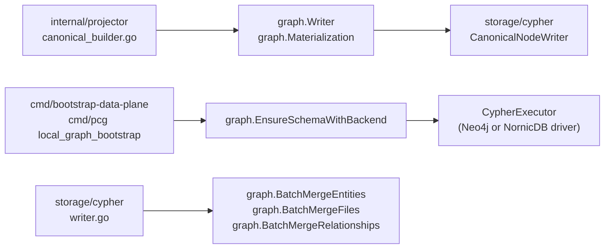

# Graph

## Purpose

`graph` owns the source-local graph write contract and the Cypher builders
used by backend adapters and schema bootstrap. It defines the `Writer` port,
the `Materialization` and `Record` input types, canonical entity merge
builders, batched UNWIND helpers, file and repository deletion mutations, and
the `EnsureSchema` constraint and index contract for both Neo4j and NornicDB
dialects.

`CypherStatement` and `CypherExecutor` live here rather than in
`internal/storage/cypher` to avoid an import cycle between the two packages.

## Where this fits



## Internal structure

```
graph/
  writer.go      — Writer, Materialization, Record, Result, MemoryWriter
  cypher.go      — CypherStatement, CypherExecutor
  entity.go      — EntityProps, BuildEntityMergeStatement, MergeEntity, validators
  batch.go       — BatchEntityRow, BatchFileRow, BatchRelationshipRow, batch helpers
  mutations.go   — DeleteFileFromGraph, DeleteRepositoryFromGraph, ResetRepositorySubtreeInGraph
  schema.go      — SchemaBackend, EnsureSchema, EnsureSchemaWithBackend, SchemaStatements
```

## Ownership boundary

`graph` owns the write contract, entity merge builders, UNWIND helpers,
deletion mutations, and the schema DDL contract. It does not own backend
drivers, connection pooling, or telemetry instrumentation. Those live in
`internal/storage/cypher`, `internal/storage/neo4j`, and their NornicDB
equivalents. Backend dialect differences belong only in the schema dialect
helpers (`schemaDialectForBackend`, `nornicDBSchemaConstraint`).

## Exported surface

### Write contract

- `Writer` — narrow interface: `Write(context.Context, Materialization) (Result, error)`.
- `Materialization` — source-local write payload: `ScopeID`, `GenerationID`,
  `SourceSystem`, `Records`. `Materialization.ScopeGenerationKey()` returns a
  durable boundary string.
- `Record` — one write candidate: `RecordID`, `Kind`, `Attributes`, `Deleted`.
  `Record.Clone()` and `Materialization.Clone()` produce copy-safe values.
- `Result` — write summary: `ScopeID`, `GenerationID`, `RecordCount`,
  `DeletedCount`.
- `MemoryWriter` — in-memory `Writer` for tests and adapters.

### Cypher seam

- `CypherStatement` — one executable statement: `Cypher` string,
  `Parameters map[string]any`.
- `CypherExecutor` — interface: `ExecuteCypher(context.Context, CypherStatement) error`.

### Entity merges

- `EntityProps` — merge inputs: `Label`, `FilePath`, `Name`, `LineNumber`,
  `UID`, `Extra`.
- `ValidateCypherLabel(label string) error` — rejects labels outside the
  safe pattern.
- `ValidateCypherPropertyKeys(keys []string) error` — rejects keys with
  unsafe characters.
- `BuildEntityMergeStatement(props EntityProps) (CypherStatement, error)` —
  builds a MERGE by `uid` when `UID` is set, otherwise by
  `(name, path, line_number)`.
- `MergeEntity(ctx, executor, props)` — executes one entity merge.

### Batch UNWIND

- `DefaultBatchSize` = 500.
- `BatchEntityRow`, `BatchFileRow`, `BatchRelationshipRow` — row types for
  batch writes.
- `BatchMergeEntities(ctx, executor, label, rows, batchSize)` — splits rows
  into UID-identity and name-identity groups and merges each group in
  `batchSize`-row chunks.
- `BatchMergeFiles(ctx, executor, rows, batchSize)` — batch-merges
  `File` nodes.
- `BatchMergeRelationships(ctx, executor, rows, batchSize)` — batch-merges
  relationships. All rows must share source label, target label, and
  relationship type.

### Mutations

- `DeleteFileFromGraph(ctx, executor, filePath)` — deletes a file node and
  its contained entities; prunes orphaned parent directories in a second
  statement.
- `DeleteRepositoryFromGraph(ctx, executor, repoIdentifier) (bool, error)` —
  removes the `Repository` node and its entire owned subtree.
- `ResetRepositorySubtreeInGraph(ctx, executor, repoIdentifier) (bool, error)` —
  deletes the owned subtree while preserving the `Repository` node itself.

### Schema

- `SchemaBackend` — string enum: `SchemaBackendNeo4j`, `SchemaBackendNornicDB`.
- `SchemaStatements() []string` — returns the ordered Neo4j DDL statements
  without executing them; useful for inspection.
- `SchemaStatementsForBackend(backend SchemaBackend) ([]string, error)` —
  returns the dialect-specific ordered DDL statements.
- `EnsureSchema(ctx, executor, logger)` — creates constraints and indexes for
  the Neo4j backend. Individual failures are logged as warnings and do not
  abort the remaining statements.
- `EnsureSchemaWithBackend(ctx, executor, logger, backend)` — same, but
  routes through the selected backend dialect.

See `doc.go` for the godoc contract.

## Dependencies

Standard library (`context`, `fmt`, `log/slog`, `regexp`, `strings`). No
internal-package imports. `CypherStatement` and `CypherExecutor` duplicate
their `storage/cypher` counterparts by design to avoid a cycle.

## Telemetry

`EnsureSchema` and `EnsureSchemaWithBackend` log per-statement warnings via
`slog` when DDL fails and continue executing remaining statements. No metrics
or span instruments are registered here; backend executors own those.

## Gotchas / invariants

- `cypherSafePattern` (`entity.go:12`) accepts `[a-zA-Z_][a-zA-Z0-9_]*` only.
  Callers passing dynamic label or property-key strings must call
  `ValidateCypherLabel` or `ValidateCypherPropertyKeys` before building a
  statement; the builders return errors if validation fails.
- `BatchMergeEntities` splits rows into UID-identity and name-identity groups
  (`batch.go:102`) so each MERGE clause can hit a graph index directly. All
  rows in a single call must share the same `Label`.
- `BatchMergeRelationships` reads `SourceLabel`, `TargetLabel`, and `RelType`
  from the first row (`batch.go:208`) and requires every subsequent row to
  match. Mixed-type rows must be split into separate calls.
- `Module` nodes use `CREATE INDEX` not a uniqueness constraint (`schema.go:57`)
  because canonical import-graph writes MERGE on the globally shared `name`
  property while semantic entity writes MERGE on the per-repo `uid`. A global
  name uniqueness constraint causes `ConstraintValidationFailed` when multiple
  repositories share module names like `consts` or `index`.
- `NornicDB` composite `IS UNIQUE` constraints are silently dropped
  (`schema.go:467`) because NornicDB's parser rejects the multi-property form.
  Canonical writes use separate `uid` uniqueness constraints for those labels
  instead.
- `DeleteFileFromGraph` runs two sequential `ExecuteCypher` calls
  (`mutations.go:29`, `:41`). If the second call fails, orphaned directories
  may remain until the next deletion or schema repair.
- `ResetRepositorySubtreeInGraph` preserves the `Repository` node;
  `DeleteRepositoryFromGraph` removes it. Choosing the wrong one during
  re-ingestion will leave a stale or missing root node.
- The schema contract is the checked-in Go-owned truth for node labels,
  constraints, performance indexes, and full-text indexes. Changes here must
  update the active ADR chunk status row.

## Related docs

- `docs/docs/architecture.md` — ownership table
- `docs/docs/adrs/2026-04-22-nornicdb-graph-backend-candidate.md` — NornicDB
  compatibility dialect evidence
- `go/internal/storage/cypher/README.md` — canonical write adapters that
  implement `Writer` and use the batch/mutation helpers
