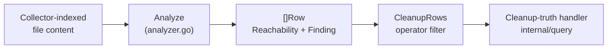
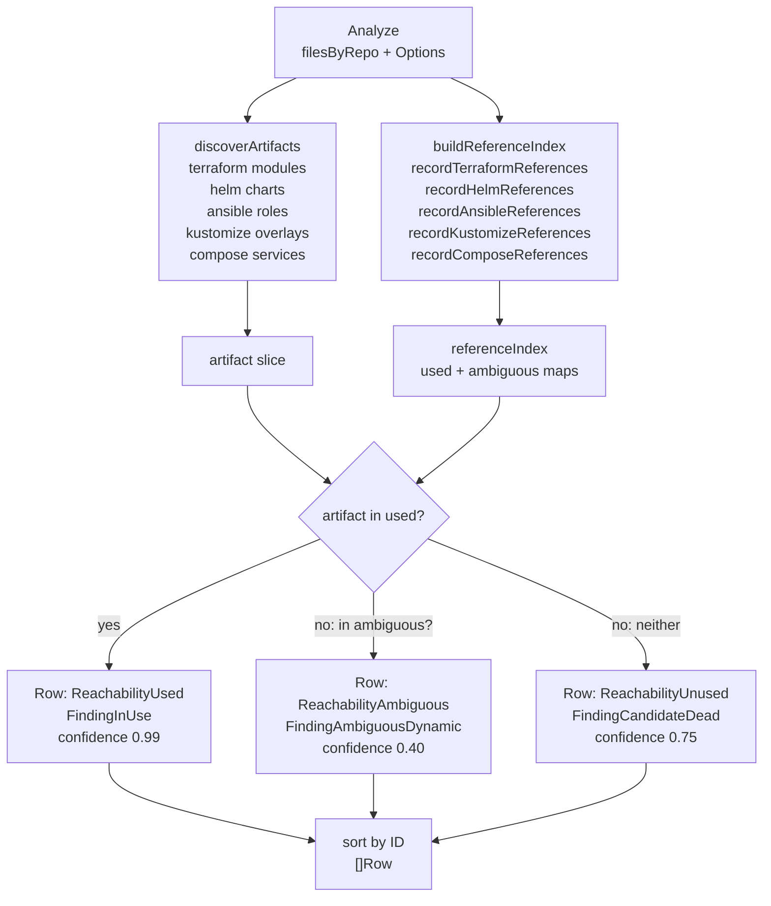

# IAC Reachability

## Purpose

`iacreachability` classifies Terraform modules, Helm charts, Ansible roles,
Kustomize overlays, and Docker Compose services as used, unused, or ambiguous
from bounded repository content evidence. It powers the cleanup-truth surface
that flags IaC artifacts operators may be able to remove.

The package consumes file content already shaped by upstream collectors. It
does not read repositories, render templates, or write graph nodes.

## Where this fits in the pipeline

`Analyze` is called from the cleanup-truth HTTP handler in `internal/query`
after the query layer pre-filters candidate files with `RelevantFile`.

## Internal flow

## Lifecycle / workflow

`Analyze` receives `filesByRepo` — a `map[string][]File` keyed by repository
ID — and an `Options` that carries a `Families` filter and `IncludeAmbiguous`
flag.

Artifact discovery (`discoverArtifacts`) walks every file path looking for
structural signals: a `modules/<name>/` directory segment means a Terraform
module artifact, a `charts/<name>/Chart.yaml` path means a Helm chart, a
`roles/<name>/tasks/` path means an Ansible role, a `kustomization.yaml` or
`kustomization.yml` file means a Kustomize overlay, and a parsed
`compose.yaml` / `docker-compose.yaml` service block means a Compose service.

Reference indexing (`buildReferenceIndex`) scans every file's content and
populates two maps inside `referenceIndex`: `used` (statically resolvable
references) and `ambiguous` (references containing template expressions that
cannot be resolved without a renderer). Compose service detection also examines
shell-like content for `docker compose <subcommand> <service>` invocations.

Each artifact is then matched: if its key appears in `used`, it becomes
`ReachabilityUsed` with `FindingInUse` at confidence 0.99. If it appears only
in `ambiguous`, it becomes `ReachabilityAmbiguous` with
`FindingAmbiguousDynamic` at confidence 0.40 and is included only when
`Options.IncludeAmbiguous` is true. Otherwise it becomes `ReachabilityUnused`
with `FindingCandidateDead` at confidence 0.75. Output rows are sorted by `ID`
for deterministic output.

`CleanupRows` is the operator-facing filter that returns only `ReachabilityUnused`
rows and optionally `ReachabilityAmbiguous` rows, sorted by `ID`.

## Exported surface

- `Analyze(filesByRepo, opts)` — main entry: discover artifacts and classify
  each by reachability (`analyzer.go:78`)
- `CleanupRows(rows, includeAmbiguous)` — filter to unused and optionally
  ambiguous rows for operator review (`analyzer.go:104`)
- `FamilyFilter(families)` — normalize a family list into the
  `Options.Families` map (`analyzer.go:123`)
- `RelevantFile(relativePath)` — cheap pre-filter: returns true for `.tf`,
  `.hcl`, `.yaml`, `.yml`, and Jenkinsfile paths (`analyzer.go:139`)
- `Reachability` — string enum: `ReachabilityUsed`, `ReachabilityUnused`,
  `ReachabilityAmbiguous` (`analyzer.go:12`)
- `Finding` — string enum: `FindingInUse`, `FindingCandidateDead`,
  `FindingAmbiguousDynamic` (`analyzer.go:25`)
- `File` — bounded content input: `RepoID`, `RelativePath`, `Content`
  (`analyzer.go:38`)
- `Options` — analyzer scope control: `Families` filter map and
  `IncludeAmbiguous` flag (`analyzer.go:45`)
- `Row` — one IaC artifact classification result: `ID`, `Family`, `RepoID`,
  `ArtifactPath`, `ArtifactName`, `Reachability`, `Finding`, `Confidence`,
  `Evidence`, `Limitations` (`analyzer.go:51`)

## Dependencies

- `gopkg.in/yaml.v3` — Compose document parsing in `compose.go`. This is the
  only external dependency.

No PCG-internal packages are imported.

## Telemetry

This package does not emit metrics, spans, or structured logs. The
cleanup-truth handler in `internal/query` owns call-site instrumentation.

## Operational notes

- Confidence values are fixed by design: 0.99 for `in_use`, 0.75 for
  `candidate_dead_iac`, 0.40 for `ambiguous_dynamic_reference`. These values
  affect operator ranking and must not be changed without understanding the
  downstream sort order in the cleanup-truth surface.
- `RelevantFile` is the cheap pre-filter callers must run before populating
  `filesByRepo`. Files outside the supported extension list are silently
  ignored by the internal extractor predicates, but passing them in wastes
  allocation and parse time.
- Ambiguity is the signal that a template expression exists that the static
  analyzer cannot resolve — not that the artifact is probably unused. Operators
  should obtain renderer or runtime evidence before acting on ambiguous rows.
- Compose service detection (`compose.go`) reads `services:` keys from YAML
  and also examines shell-like content for `docker compose <subcommand>
  <service>` invocations. A Compose service is only classified as `in_use`
  when an invocation explicitly names it after a recognized subcommand such
  as `up`, `run`, or `start`.
- Output rows are sorted by `Row.ID` (`family:repoID:path`) for deterministic
  diffs in tests and stable HTTP responses.

## Extension points

- **Add a new artifact family** → add a discovery function following the
  pattern of `terraformModuleArtifact` or `helmChartArtifact`, add a
  reference recorder following `recordTerraformReferences`, wire both into
  `discoverArtifacts` and `buildReferenceIndex`, and extend `RelevantFile` to
  cover the new file extensions. Add a constant to the `Families` map key
  documentation.
- **Adjust family scope** → pass a non-nil `Options.Families` map to
  `Analyze` to restrict processing to a subset of families. The `familyEnabled`
  predicate gates all discovery and reference recording on this map.

## Gotchas / invariants

- Template expressions (`{{` or `${`) anywhere in a reference value cause the
  containing reference to be recorded as ambiguous, not used. There is no
  partial resolution.
- Ansible role reachability is two-step: a role is only classified as `in_use`
  if a playbook that references it is itself reached by a `ansible-playbook`
  invocation found in the content. Roles in unreached playbooks are treated
  as unused.
- Kustomize path references must look like overlay or base paths
  (`/base/`, `/overlays/`, `base/`, `overlays/`) to be indexed as used. Generic
  YAML paths are not indexed.
- `Row.ID` is `family:repoID:path`. Two artifacts with the same family, repo,
  and path would collide; the `appendUniqueArtifact` deduplication prevents
  this within a single `Analyze` call but does not prevent cross-call
  duplicates if the caller merges results.

## Related docs

- `docs/docs/architecture.md` — pipeline and ownership table
- `docs/docs/reference/http-api.md` — cleanup-truth HTTP surface
- `go/internal/relationships/README.md` — complement: evidence-based
  relationship extraction
