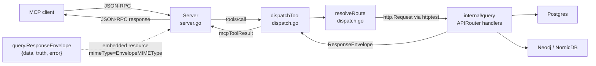
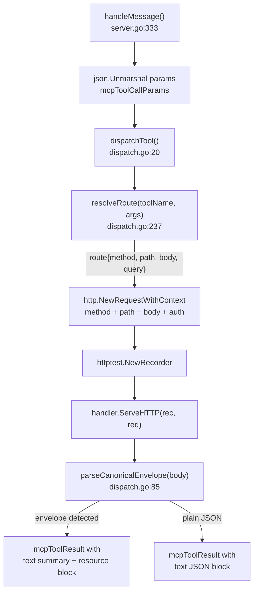

# internal/mcp

`mcp` owns the Model Context Protocol tool surface for PCG. It implements the
MCP server, the JSON-RPC dispatcher, the SSE session model, and the 41
read-only tool definitions. Tool dispatch calls into the same `http.Handler`
chain the HTTP API uses, so a tool response and the corresponding HTTP query
response share the same truth.

## Where this fits in the pipeline

## Internal flow — one tool invocation

## Tool groups

`ReadOnlyTools` assembles 41 tools from five source files.

| Group | Count | Source file |
|---|---|---|
| `codebaseTools` | 13 | `tools_codebase.go` |
| `ecosystemTools` | 14 | `tools_ecosystem.go` |
| `contextTools` | 6 | `tools_context.go` |
| `contentTools` | 5 | `tools_content.go` |
| `runtimeTools` | 3 | `tools_runtime.go` |

Representative tool-to-route mappings from `resolveRoute` (`dispatch.go:237`):

| Tool | HTTP method | Path |
|---|---|---|
| `find_code` | POST | `/api/v0/code/search` |
| `analyze_code_relationships` | POST | `/api/v0/code/relationships` |
| `find_dead_iac` | POST | `/api/v0/iac/dead` |
| `get_relationship_evidence` | GET | `/api/v0/evidence/relationships/{resolved_id}` |
| `trace_deployment_chain` | POST | `/api/v0/impact/trace-deployment-chain` |
| `resolve_entity` | POST | `/api/v0/entities/resolve` |
| `get_file_content` | POST | `/api/v0/content/files/read` |
| `list_ingesters` | GET | `/api/v0/status/ingesters` |

## Exported surface

| Identifier | File | Notes |
|---|---|---|
| `Server` | `server.go:94` | MCP server struct; fields `handler`, `tools`, `logger`, `sessions` |
| `NewServer` | `server.go:107` | constructs `Server`; calls `ReadOnlyTools()` to populate `tools` |
| `Server.Run` (`Run`) | `server.go:288` | stdio transport; reads stdin, writes stdout |
| `Server.RunHTTP` (`RunHTTP`) | `server.go:128` | HTTP+SSE transport; listens on `addr` |
| `ToolDefinition` | `types.go:4` | `Name`, `Description`, `InputSchema` |
| `ReadOnlyTools` | `types.go:11` | returns all 41 tool definitions |

## SSE session model

`handleSSE` (`server.go:181`) creates an `sseSession` with a 64-element
channel. It sends an `endpoint` event with the POST URL, then loops on the
session channel and a 30-second keepalive ticker. `handleHTTPMessage`
(`server.go:241`) routes responses to the session channel when a `sessionId`
query param is present and returns HTTP 202; otherwise it returns the response
directly with HTTP 200.

## Dependencies

Internal packages: `internal/buildinfo` (version string for `mcpInitializeResult`),
`internal/query` (`query.ResponseEnvelope`, `query.EnvelopeMIMEType`, the
mounted `http.Handler`). No direct dependency on storage drivers, facts, or
telemetry metric instruments.

## Telemetry

This package does not declare its own metrics or spans. Spans and metrics are
emitted by the `internal/query` handlers that `dispatchTool` calls into.
Structured log events in `server.go`: `"mcp server started"` (with `transport`
and `tools` count), `"sse session started"`, `"sse session closed"`, and
`"sse session buffer full"`. `dispatchTool` logs at debug level with tool name,
HTTP method, and path (`dispatch.go:26`).

## Operational notes

The `Accept: application/pcg.envelope+json` header is always set on internal
dispatch requests (`dispatch.go:44`). Handlers that check this header will
return the canonical envelope shape.

`normalizeQualifiedIdentifier` strips the `workload:` prefix from service
identifiers before building path segments. If a new service tool is added,
apply this helper when the input may include a type qualifier.

`contentSearchBody` normalises `repo_ids` to a single `repo_id` when only one
element is present. The function uses `firstString` to extract the first
element and sets `repo_id` rather than `repo_ids`.

## Extension points

- **Add a tool**: add a `ToolDefinition` to the matching `tools_*.go` file,
  add a `case` in `resolveRoute` in `dispatch.go`, and add a test in
  `tools_test.go` and `dispatch_test.go`. The `ReadOnlyTools` count test and
  the dispatch route test will both catch missing or mismatched entries.
- **Add an argument helper**: add to `dispatch.go` near `str`, `intOr`,
  `boolOr`, and `stringSlice`. Keep the helpers side-effect-free.

## Gotchas / invariants

- Every tool name returned by `ReadOnlyTools` must have a matching `case` in
  `resolveRoute` (`dispatch.go:237`). A test in `tools_test.go` calls
  `resolveRoute` for every tool and fails if any returns an error.

- `parseCanonicalEnvelope` (`dispatch.go:85`) requires all three keys `data`,
  `truth`, and `error` to be present in the response JSON. A partial envelope
  falls back to the plain JSON path.

- Changing `ToolDefinition.Name` or `ReadOnlyTools` output is a breaking change
  for any MCP client that has cached tool names. Coordinate with the MCP guide
  and a version bump.

- The `Envelope` field of `dispatchResult` is populated by
  `parseCanonicalEnvelope` (`server.go:377`). When it is non-nil, the response
  is returned as a two-block `mcpToolResult`. Do not substitute the
  `query.EnvelopeMIMEType` string literal; use the constant.

## Related docs

- `docs/docs/guides/mcp-guide.md` — client setup, tool usage, and story-first
  orchestration patterns
- `docs/docs/reference/http-api.md` — underlying HTTP routes that every tool
  dispatches into
- `docs/docs/architecture.md` — service boundary for the MCP runtime
- `go/cmd/mcp-server/README.md` — binary wiring, transport selection, and
  admin surface
