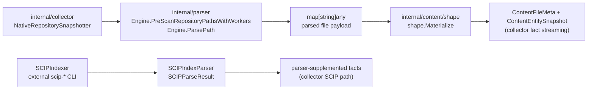
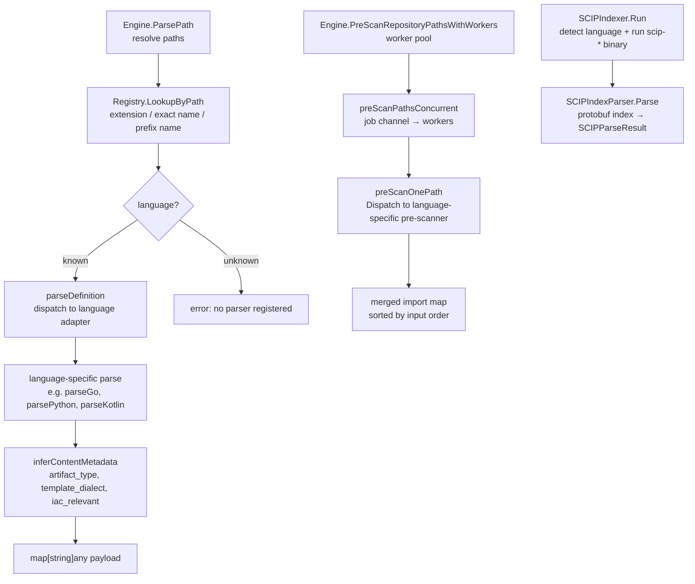

# Parser

## Purpose

`internal/parser` owns the native Go parser registry, language adapters, and
SCIP reduction support used to extract source-level entities and metadata.
Parser changes must preserve fact truth: when a parser starts emitting a new
entity, relationship, or metadata field, the relevant fixtures, fact contracts
in `internal/facts`, and downstream docs must move in lockstep. Parsers must
be deterministic given the same source bytes so retries and repair runs
converge.

## Where this fits in the pipeline

## Internal flow

## Lifecycle / workflow

`Engine` is the single dispatch point for both parse and pre-scan operations.
`DefaultEngine()` constructs an engine from `DefaultRegistry()` and
`NewRuntime()`. `NewRuntime` allocates a thread-safe cache of tree-sitter
language handles; grammars are loaded on first use and reused across calls.

`Engine.ParsePath` resolves both `repoRoot` and `path` to absolute form, calls
`Registry.LookupByPath` to identify the language, then dispatches to the
language-specific adapter function (e.g. `parseGo`, `parsePython`,
`parseKotlin`). After the language adapter returns, `inferContentMetadata` sets
`artifact_type`, `template_dialect`, and `iac_relevant` on the payload. The
final payload also carries `repo_path`.

`Engine.PreScanRepositoryPathsWithWorkers` runs a pre-scan pass that extracts
import names and referenced symbol names from each file. Results are merged
across workers and sorted by input order to produce a deterministic import map.
The pre-scan is a lighter parse used to build cross-file import context before
the full parse pass.

**SCIP path**: when SCIP_INDEXER=true, the collector snapshotter detects the
dominant SCIP-capable language via `DetectSCIPProjectLanguage`, runs the
external `scip-*` binary via `SCIPIndexer.Run`, and parses the resulting
protobuf index via `SCIPIndexParser.Parse`. The SCIP result supplements the
native tree-sitter parse for supported languages (Go, Python, TypeScript,
JavaScript, Rust, Java, C, C++).

## Exported surface

- `Engine` — dispatch hub; constructed via `DefaultEngine()` or `NewEngine(registry, runtime)`
- `DefaultEngine()` — builds an engine from the built-in registry and a fresh
  tree-sitter runtime
- `NewEngine(registry, runtime)` — constructs an engine from provided `Registry`
  and `Runtime`
- `Engine.ParsePath(repoRoot, path, isDependency, options)` — parse one file;
  returns `map[string]any`
- `Engine.PreScanPaths(paths)` — import-map contract for collector prescan
- `Engine.PreScanRepositoryPaths(repoRoot, paths)` — repo-bounded prescan
- `Engine.PreScanRepositoryPathsWithWorkers(repoRoot, paths, workers)` — concurrent prescan
- `Registry` — immutable parser catalog
- `NewRegistry(definitions)` — builds an immutable registry; panics in
  `DefaultRegistry()` if the built-in definitions are invalid
- `DefaultRegistry()` — built-in catalog for this wave of supported languages
- `Registry.LookupByPath(path)` — extension / exact name / prefix name lookup;
  `.tfvars.json` routes to the `hcl` definition
- `Registry.LookupByExtension(extension)` — direct extension lookup
- `Registry.LookupByParserKey(parserKey)` — direct key lookup
- `Registry.Definitions()` — cloned definitions in deterministic parser-key order
- `Registry.ParserKeys()` — registered keys in deterministic order
- `Registry.Extensions()` — registered extensions in sorted order
- `Definition` — `ParserKey`, `Language`, `Extensions`, `ExactNames`, `PrefixNames`
- `Runtime` — tree-sitter language handle cache; `Language(name)` returns a
  cached `*tree_sitter.Language`
- `NewRuntime()` — constructs a fresh tree-sitter runtime
- `Options` — `IndexSource bool`, `VariableScope string`
- `SCIPIndexer` — runs an external `scip-*` CLI; fields: `LookPath`,
  `RunCommand`, `Timeout`
- `SCIPIndexParser` — parses a SCIP protobuf index into `SCIPParseResult`
- `SCIPParseResult` — parsed SCIP output for downstream fact emission
- `DetectSCIPProjectLanguage(paths, allowed)` — dominant SCIP-capable language
  by file extension count, filtered to the allowed set
- `ExtractDockerfileRuntimeMetadata(sourceText)` — exported utility for
  Dockerfile runtime metadata extraction
- `ExtractGroovyPipelineMetadata(sourceText)` — exported utility for Groovy
  pipeline metadata extraction
- `ColumnLineage`, `CompiledModelLineage` — dbt/SQL lineage records

## Registered languages and tree-sitter support

| Language | Parser key | Extensions | Tree-sitter native |
| --- | --- | --- | --- |
| C | `c` | `.c` | yes |
| C# | `c_sharp` | `.cs`, `.csx` | yes |
| C++ | `cpp` | `.cc`, `.cpp`, `.cxx`, `.h`, `.hh`, `.hpp` | yes |
| Dart | `dart` | `.dart` | — |
| Dockerfile | `__dockerfile__` | `Dockerfile`, `Dockerfile.*` | — |
| Elixir | `elixir` | `.ex`, `.exs` | — |
| Go | `go` | `.go` | yes |
| Groovy/Jenkinsfile | `groovy`, `__jenkinsfile__` | `.groovy`, `Jenkinsfile` | — |
| Haskell | `haskell` | `.hs` | — |
| HCL/Terraform | `hcl` | `.hcl`, `.tf`, `.tfvars`, `.tfvars.json` | — |
| Java | `java` | `.java` | yes |
| JavaScript | `javascript` | `.cjs`, `.js`, `.jsx`, `.mjs` | yes |
| JSON | `json` | `.json` | — |
| Kotlin | `kotlin` | `.kt` | — |
| Perl | `perl` | `.pl`, `.pm` | — |
| PHP | `php` | `.php` | — |
| Python | `python` | `.ipynb`, `.py`, `.pyw` | yes |
| Raw text | `raw_text` | `.cnf`, `.cfg`, `.conf`, `.j2`, `.jinja`, `.jinja2`, `.tpl`, `.tftpl` | — |
| Ruby | `ruby` | `.rb` | — |
| Rust | `rust` | `.rs` | yes |
| Scala | `scala` | `.sc`, `.scala` | yes |
| SQL | `sql` | `.sql` | — |
| Swift | `swift` | `.swift` | — |
| TSX | `tsx` | `.tsx` | yes (TypeScript grammar) |
| TypeScript | `typescript` | `.cts`, `.mts`, `.ts` | yes |
| YAML | `yaml` | `.yaml`, `.yml` | — |

## SCIP support

SCIP provides higher-fidelity cross-file symbol resolution for languages where
tree-sitter alone cannot reliably produce type-qualified call graphs. The SCIP
path in PCG:

1. `DetectSCIPProjectLanguage` scans file extensions to find the dominant
   SCIP-capable language (priority: Python, TypeScript, JavaScript, Go, Rust,
   Java, C++, C).
2. `SCIPIndexer.Run` invokes the external binary (`scip-go`, `scip-python`,
   `scip-typescript`, `scip-rust`, `scip-java`, `scip-clang`) and returns the
   generated index path.
3. `SCIPIndexParser.Parse` reads the protobuf index and returns `SCIPParseResult`
   for downstream fact emission.
4. SCIP results supplement — not replace — native tree-sitter output for the
   same repository.

SCIP is opt-in via SCIP_INDEXER=true. The allowed language list defaults to
`python,typescript,go,rust,java` and is overridden via SCIP_LANGUAGES.

## Dependencies

- `github.com/tree-sitter/go-tree-sitter` — `Runtime` and grammar dispatch
- Tree-sitter grammar bindings: C, C#, C++, Go, Java, JavaScript, Python, Rust,
  Scala, TypeScript
- `internal/terraformschema` — provider schema assets consumed by the HCL adapter
- Standard library only for non-tree-sitter adapters

The parser package does not import `internal/projector`, `internal/reducer`,
`internal/storage`, `internal/query`, or `internal/collector`.

## Telemetry

The parser package does not emit metrics or spans directly. Parse timing is
recorded by the collector snapshotter via the `telemetry.FileParseDuration`
instrument (metric: `pcg_dp_file_parse_duration_seconds`). Parse
errors are surfaced in `collector snapshot stage completed` logs with
`stage=parse`.

## Operational notes

- `DefaultRegistry()` panics if the built-in `defaultDefinitions()` list
  contains a duplicate parser key, extension, or filename. This is a
  programming error, not an operational condition, and surfaces immediately on
  process start.
- `Runtime.Language(name)` caches tree-sitter grammar handles under a mutex.
  The first call per grammar loads the native grammar; subsequent calls return
  the cached handle. Do not call `NewRuntime()` per file — share one runtime
  across all parse calls.
- The SCIP binaries (`scip-go`, `scip-python`, etc.) must be on PATH. Use
  `SCIPIndexer.LookPath` to verify availability before enabling SCIP_INDEXER.

## Extension points

- `NewRegistry(definitions)` — build a custom registry for test suites or
  plugin-supplied language definitions; pass it to `NewEngine`
- `SCIPIndexer.LookPath` and `SCIPIndexer.RunCommand` — injectable seams for
  testing the SCIP path without external binaries
- `Registry.LookupByPath` — the discovery package's file matcher predicate
  is built from this lookup, so a custom registry produces a custom file
  matcher automatically

## Gotchas / invariants

- Parser output is a `map[string]any` keyed by convention (e.g. `functions`,
  `classes`, `imports`). There is no compile-time schema; callers in
  the collector's `buildParsedRepositoryFiles` and
  `shape.Materialize` consume keys by string. Adding a new key to a language
  adapter's output requires corresponding updates in `content/shape` and
  downstream fact contracts.
- `Engine.ParsePath` resolves both `repoRoot` and `path` to absolute form.
  Passing a relative path produces an absolute resolved path in the payload's
  `repo_path` field; this is correct behavior but callers should pass absolute
  paths to avoid ambiguity.
- `preScanPathsConcurrent` sorts results by input index before merging to
  preserve deterministic output. Do not remove this sort; out-of-order merging
  makes import maps non-deterministic across runs.
- SCIP and tree-sitter parse results for the same file may overlap. The
  collector's SCIP path builds supplemented facts by combining both; do not
  assume SCIP output supersedes tree-sitter output entirely.

## Related docs

- `docs/docs/architecture.md` — parser ownership
- `docs/docs/reference/local-testing.md` — parser test gates
- `docs/docs/reference/telemetry/index.md` — `pcg_dp_file_parse_duration_seconds`
- `go/internal/collector/README.md` — how the collector calls the parser
- `go/internal/facts/` — fact contract shape for emitted entities
