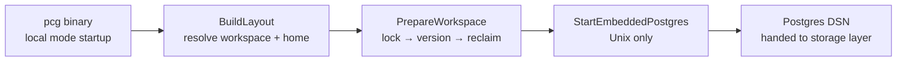

# PCG Local

## Purpose

`pcglocal` implements the local-host filesystem contract for the lightweight
code-intelligence runtime. It owns workspace-root resolution, the
`${PCG_HOME}/local/workspaces/<id>/` directory layout, the `owner.lock` flock
protocol, the `owner.json` record, VERSION file management, and embedded
Postgres lifecycle. The layout spec lives in
`docs/docs/reference/local-data-root-spec.md`; the startup admission order is
defined in `docs/docs/reference/local-host-lifecycle.md`.

## Where this fits in the pipeline

`pcglocal` is used exclusively for local developer-laptop profiles
(`local_lightweight`, `local_authoritative`). Deployed service runtimes never
call this package.

## Ownership boundary

This package owns:

- workspace-root resolution (`ResolveWorkspaceRoot`, `ResolveHomeDir`)
- stable workspace ID derivation (`WorkspaceID`)
- filesystem layout (`BuildLayout`, `Layout`)
- the `owner.lock` flock protocol (`AcquireOwnerLock`, `OwnerLock`,
  `ErrWorkspaceOwned`)
- the `owner.json` record (`OwnerRecord`, `ReadOwnerRecord`, `WriteOwnerRecord`)
- VERSION file lifecycle (`EnsureLayoutVersion`, `ReadLayoutVersion`,
  `WriteLayoutVersion`, `ErrIncompatibleLayoutVersion`)
- startup admission (`PrepareWorkspace`, `StartupDeps`)
- owner reclaim and stale-process detection (`ValidateOrReclaimOwner`,
  `ReclaimDeps`, `DefaultReclaimDeps`, `ProcessAlive`, `SocketHealthy`,
  `StopEmbeddedPostgres`)
- embedded Postgres lifecycle on Unix (`ManagedPostgres`, `StartEmbeddedPostgres`,
  `PostgresDSN`, `LocalQueryProfile`)

This package never touches the durable graph backend, Postgres schema, work
queue, or any shared service state.

## Platform split

Three sets of files implement platform-specific behavior behind `//go:build`
tags:

| Symbol group | Unix (`!windows`) | Windows stub |
| --- | --- | --- |
| `OwnerLock`, `AcquireOwnerLock` | `owner_lock_unix.go` — `unix.Flock` LOCK_EX\|LOCK_NB | `owner_lock_windows.go` — returns error |
| `ManagedPostgres`, `StartEmbeddedPostgres`, `PostgresDSN` | `postgres_unix.go` — real embedded Postgres | `postgres_windows.go` — returns error |
| `ProcessAlive`, `SocketHealthy`, `StopEmbeddedPostgres`, `DefaultReclaimDeps` | `health_unix.go` — `unix.Kill`, socket dial, `pg_ctl` | `health_windows.go` — returns false / error |

The lightweight local runtime is Unix-only. Windows stubs compile but always
fail loudly.

## Exported surface

See `doc.go` for the godoc contract.

Layout:

- `Layout` — path bundle for one workspace: `HomeDir`, `WorkspaceRoot`,
  `WorkspaceID`, `RootDir`, `VersionPath`, `OwnerLockPath`, `OwnerRecordPath`,
  `GraphDir`, `PostgresDir`, `LogsDir`, `CacheDir`.
- `ResolveHomeDir(getenv, userHomeDir, goos)` — resolves the PCG home root;
  respects PCG_HOME override and per-OS defaults.
- `ResolveWorkspaceRoot(startPath, explicitRoot)` — walks ancestors for
  `.pcg.yaml`, then `.git`; falls back to `startPath`.
- `WorkspaceID(workspaceRoot)` — SHA-256 of the normalized absolute path (20
  bytes, hex); case-insensitive filesystems lowercase before hashing.
- `BuildLayout(getenv, userHomeDir, goos, workspaceRoot)` — composes the full
  `Layout` value from `ResolveHomeDir` and `WorkspaceID`.

Owner lock:

- `OwnerLock`, `AcquireOwnerLock(path)`, `OwnerLock.Close()`,
  `ErrWorkspaceOwned` — non-blocking exclusive flock (Unix); stub on Windows.

Owner record:

- `OwnerRecord` — JSON-encoded workspace metadata: PID, started-at timestamp,
  hostname, workspace ID, version, socket path, and per-backend Postgres and
  graph fields.
- `ReadOwnerRecord(path)`, `WriteOwnerRecord(path, record)` — read and atomic
  write (temp-file + rename).

Version:

- `EnsureLayoutVersion(layout, currentVersion)` — creates layout directories,
  validates or writes the VERSION file; returns `ErrIncompatibleLayoutVersion`
  when the version does not match.
- `ReadLayoutVersion(path)`, `WriteLayoutVersion(path, version)` — atomic read
  and write.

Startup admission:

- `StartupDeps` — dependency struct for startup injection points.
- `PrepareWorkspace(layout, currentVersion, deps)` — admission sequence: acquire
  lock, validate version, validate or reclaim owner.

Reclaim:

- `ReclaimDeps` — injected health check functions for reclaim decisions.
- `ValidateOrReclaimOwner(layout, currentVersion, deps)` — checks PID and socket
  liveness before removing a stale `owner.json`. Assumes caller holds
  `owner.lock`.
- `DefaultReclaimDeps()` — returns production reclaim probes for Unix; Windows
  stub returns placeholder deps.
- `ProcessAlive(pid)`, `SocketHealthy(path)`, `StopEmbeddedPostgres(dataDir)` —
  Unix: `unix.Kill` signal-0, socket dial, `pg_ctl fast stop`. Windows: stubs.
- `ErrWorkspaceOwnerActive`, `ErrEmbeddedPostgresActive`, `ErrGraphBackendActive`,
  `ErrInvalidOwnerRecord` — typed errors for reclaim failure modes.

Embedded Postgres (Unix only):

- `ManagedPostgres` — runtime handle: `DSN`, `Port`, `DataDir`, `SocketDir`,
  `SocketPath`, `PID`, `CtlPath`. `Close()` runs `pg_ctl fast stop`.
- `StartEmbeddedPostgres(ctx, layout)` — starts the embedded Postgres instance,
  reserves a loopback port, waits for a successful ping, reads the postmaster
  PID. Returns an error on Windows.
- `PostgresDSN(host, port)` — builds the loopback TCP connection string.
- `LocalQueryProfile()` — returns `"local_lightweight"`.

## Dependencies

Standard library only for cross-platform files. Platform-specific files pull in:

- `golang.org/x/sys/unix` — flock and `Kill` on Unix
- `github.com/fergusstrange/embedded-postgres` — Postgres binary lifecycle on Unix
- `github.com/jackc/pgx/v5/stdlib` — ping after Postgres start on Unix

No internal-package imports. This package is a leaf in the dependency graph.

## Telemetry

None. The startup and reclaim paths do not emit metrics or spans.

## Gotchas / invariants

- `WorkspaceID` is derived from the symlink-resolved absolute path. Two checkouts
  at different absolute paths produce different IDs even when they point to the
  same files.
- `AcquireOwnerLock` is non-blocking (`LOCK_NB`). If another process holds the
  lock, it returns `ErrWorkspaceOwned` immediately — it does not wait.
- `PrepareWorkspace` releases the lock on any failure after acquisition. Do not
  hold the returned `*OwnerLock` longer than the process lifespan.
- `ValidateOrReclaimOwner` assumes the caller already holds `owner.lock`. Calling
  it without the lock creates a TOCTOU window between PID check and `owner.json`
  removal.
- Both `WriteOwnerRecord` and `WriteLayoutVersion` use temp-file-plus-rename for
  atomic writes and `Chmod(0o600)` plus `Sync()` before rename. Do not replace
  these with a direct `os.WriteFile` call.
- The socket path length for Unix-domain Postgres sockets is limited to 103
  bytes on some systems. `runtimeSocketDir` tries short paths under `/tmp` when
  the primary path would exceed this limit.
- Layout version is the `local-data-root-spec` version. Bumping it without a
  documented migration breaks existing workspaces that have data in the old
  layout.
- PCG_HOME overrides the default per-OS home root. Callers should use
  `ResolveHomeDir` rather than constructing the path themselves.
- Windows stubs compile but always return errors or false. No local runtime
  functionality is available on Windows.

## Related docs

- `docs/docs/reference/local-data-root-spec.md` — layout and VERSION spec
- `docs/docs/reference/local-host-lifecycle.md` — startup admission order
- `docs/docs/reference/local-testing.md`
- `docs/docs/architecture.md` — local profile runtime shapes
