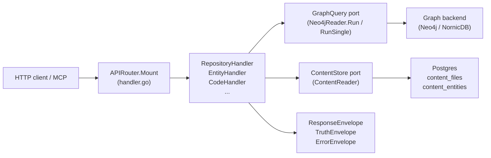
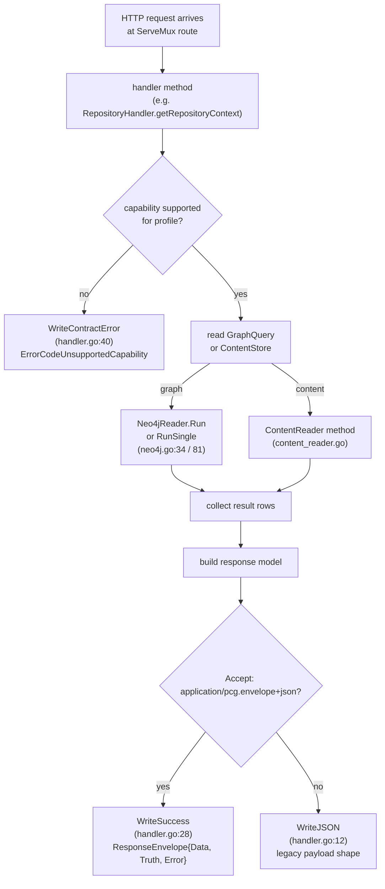

# internal/query

## Purpose

`internal/query` owns the HTTP read surface, OpenAPI assembly, response envelope
contract, and all read models that back the public PCG query API. It defines the
`GraphQuery` and `ContentStore` ports through which every handler accesses the
graph and Postgres content store, and it enforces the capability matrix that
determines which queries are permitted under each runtime profile.

## Where this fits in the pipeline

## Internal flow

## Lifecycle / workflow

An HTTP request hits one of the routes registered by `APIRouter.Mount`
(`handler.go:125`). The handler method first checks whether the requested
capability is allowed for the current `QueryProfile` using `capabilityUnsupported`
(`handler.go:105`), which consults `capabilityMatrix` in `contract.go:127`. If
the profile does not support the capability, `WriteContractError` returns HTTP
501 with a structured `ErrorEnvelope` carrying `ErrorCodeUnsupportedCapability`,
the capability ID, and the `RequiredProfile`.

For permitted requests, the handler reads data through `GraphQuery` (for graph
traversals) or `ContentStore` (for Postgres content). `Neo4jReader.Run` and
`Neo4jReader.RunSingle` (`neo4j.go:34`, `neo4j.go:81`) open a read-only Neo4j
session, execute a Cypher query, and return `[]map[string]any` rows. Row values
are extracted via `StringVal`, `BoolVal`, `IntVal`, `StringSliceVal`
(`neo4j.go:120–182`). `ContentReader` methods (`content_reader.go`) issue
parametrized Postgres queries against `content_files` and `content_entities`.

Both backends instrument every query with an OTEL span (`neo4j.query`,
`postgres.query`). Handlers that span multiple read stages use
`startQueryHandlerSpan` (`handler_tracing.go:16`) with a stable span name from
`telemetry.SpanQuery*` constants to attach route and capability attributes.
Repository and service read paths additionally emit stage-start/stage-done log
events via `repositoryQueryStageTimer` and `serviceQueryStageTimer`.

The response is written with `WriteSuccess` when the caller sends
`Accept: application/pcg.envelope+json`; this wraps the payload in a
`ResponseEnvelope` containing `data`, `truth` (`TruthEnvelope`), and `error`
fields. Without that header, `WriteJSON` emits the legacy payload directly.
`BuildTruthEnvelope` (`contract.go:383`) constructs the `TruthEnvelope`; it
panics if the capability string is not in `capabilityMatrix`.

## Exported surface

**Ports and adapters**

- `GraphQuery` — read-only graph port: `Run` and `RunSingle`; implemented by
  `Neo4jReader` (`ports.go:9`)
- `ContentStore` — Postgres content port: file, entity, and catalog reads;
  implemented by `ContentReader` (`ports.go:14`)
- `Neo4jReader` — concrete graph adapter; satisfies `GraphQuery` (`neo4j.go:18`)
- `ContentReader` — concrete Postgres content adapter; satisfies `ContentStore`
  (`content_reader.go:16`)
- `PostgresIaCReachabilityStore` — reducer-materialized IaC cleanup findings
  (`iac_reachability_store.go`)
- `IaCReachabilityStore` — port for IaC cleanup findings (`iac.go:62`)

**Handler structs**

- `APIRouter` — top-level mux; call `Mount` to register all routes
  (`handler.go:110`)
- `RepositoryHandler` — `GET /api/v0/repositories*` routes (`repository.go:21`)
- `EntityHandler` — entity resolution and workload/service context routes
  (`entity.go:11`)
- `CodeHandler` — code search, relationships, dead-code, complexity, call-chain
  (`code.go:11`)
- `ContentHandler` — file and entity content reads (`content_handler.go:11`)
- `InfraHandler` — infrastructure resource and relationship routes (`infra.go:12`)
- `IaCHandler` — IaC quality dead-code routes (`iac.go:22`)
- `ImpactHandler` — blast radius, change surface, deployment trace, dependency
  paths (`impact.go:11`)
- `EvidenceHandler` — relationship evidence drilldown (`evidence.go:14`)
- `StatusHandler` — pipeline and ingester status routes (`status.go:14`)
- `CompareHandler` — environment comparison (`compare.go:12`)
- `AdminHandler` — work-item inspection, replay, dead-letter, backfill, reindex
  (`admin.go:153`)

**Response contract types**

- `ResponseEnvelope` — top-level wire envelope: `Data`, `Truth`, `Error`
  (`contract.go:108`)
- `TruthEnvelope` — truth metadata: `Level`, `Capability`, `Profile`, `Basis`,
  `Backend`, `Freshness`, `Reason` (`contract.go:75`)
- `TruthFreshness` — freshness state and observation timestamp (`contract.go:69`)
- `ErrorEnvelope` — structured error: `Code`, `Message`, `Capability`,
  `Profiles` (`contract.go:101`)
- `ErrorCode`, `TruthLevel`, `TruthBasis`, `FreshnessState`, `QueryProfile`,
  `GraphBackend` — typed string constants (`contract.go`)

**Handler helpers**

- `WriteJSON`, `WriteError`, `WriteSuccess`, `WriteContractError` — uniform
  response writers (`handler.go`)
- `ReadJSON`, `QueryParam`, `QueryParamInt`, `PathParam` — request parsing
  helpers (`handler.go`)
- `AuthMiddleware` — bearer-token middleware used by `cmd/api` (`auth.go:30`)
- `BuildTruthEnvelope` — builds a `TruthEnvelope` from profile, capability, and
  basis; panics on unknown capability (`contract.go:383`)
- `ParseQueryProfile`, `NormalizeQueryProfile`, `ParseGraphBackend` — input
  validation helpers (`contract.go`)

**OpenAPI**

- `OpenAPISpec()` — concatenates eleven `openapi_paths_*.go` fragments and
  `openAPIComponents` into one JSON string (`openapi.go:49`)
- `ServeOpenAPI`, `ServeSwaggerUI`, `ServeReDoc` — HTTP handlers for
  `/api/v0/openapi.json`, `/api/v0/docs`, `/api/v0/redoc` (`openapi.go`)

**Graph row helpers**

- `StringVal`, `BoolVal`, `IntVal`, `StringSliceVal`, `RepoRefFromRow`,
  `RepoProjection` — safe Neo4j result-row extractors (`neo4j.go`)

See `doc.go` for the full godoc contract.

## Dependencies

- `internal/buildinfo` — `AppVersion()` embedded in the OpenAPI spec
- `internal/contentrefs` — content reference utilities used in content query paths
- `internal/iacreachability` — IaC reachability row types consumed by
  `PostgresIaCReachabilityStore`
- `internal/parser` — entity and language classification constants used for
  dead-code root detection
- `internal/recovery` — `RecoveryService` port satisfied by `recovery.Handler`;
  wired into `AdminHandler.Recovery`
- `internal/status` — `status.Reader` consumed by `StatusHandler.StatusReader`
- `internal/storage/postgres` — status store and recovery store adapters;
  query handlers never import concrete Postgres drivers directly — they go through
  `ContentStore`
- `internal/telemetry` — `EventAttr`, `DefaultServiceNamespace`, span constants
  `SpanQueryRelationshipEvidence`, `SpanQueryDeadIaC`, `SpanQueryInfraResourceSearch`

Handlers depend on the `GraphQuery` and `ContentStore` ports, not on
`neo4jdriver.DriverWithContext` or `*sql.DB` directly. `Neo4jReader` and
`ContentReader` are the only concrete types that touch drivers, and they are
wired in `cmd/api/wiring.go`, not here.

## Telemetry

- Spans: `telemetry.SpanQueryRelationshipEvidence` (`query.relationship_evidence`)
  on evidence drilldown (`evidence.go:43`); `telemetry.SpanQueryDeadIaC`
  (`query.dead_iac`) on IaC dead-code queries (`iac.go`);
  `telemetry.SpanQueryInfraResourceSearch` (`query.infra_resource_search`) on
  infrastructure search (`infra.go`). Per-query spans `neo4j.query` and
  `postgres.query` on every graph and content read.
- Metrics: `pcg_dp_neo4j_query_duration_seconds` and
  `pcg_dp_postgres_query_duration_seconds` (instruments live in
  `internal/telemetry/instruments.go`).
- Log events: `repository_query.stage_started`, `repository_query.stage_completed`
  (via `repositoryQueryStageTimer`); `service_query.stage_started`,
  `service_query.stage_completed` (via `serviceQueryStageTimer`). Both emit
  `operation`, `stage`, `repo_id`, and `duration_seconds`.

## Operational notes

- High latency on `GET /api/v0/repositories/{repo_id}/context` or story routes:
  check the `repository_query.stage_completed` log events for the slow stage
  (`graph_lookup`, `content_hydration`, etc.) before assuming the graph backend
  is the problem.
- `pcg_dp_neo4j_query_duration_seconds` rising across many routes: check graph
  backend health and query plan; do not raise handler timeouts before confirming
  the Cypher query itself is the bottleneck.
- 501 responses with `error.code=unsupported_capability`: the requested operation
  requires a higher `QueryProfile`. Check `truth.profiles.required` in the
  response envelope for the minimum profile, then verify the PCG_QUERY_PROFILE
  env var in the running API.
- `OpenAPISpec()` panics at startup if a handler calls `BuildTruthEnvelope` with
  a capability string not in `capabilityMatrix` (`contract.go:384`). Add missing
  capability IDs to `capabilityMatrix` before shipping new handlers.
- Content reads return `source_backend=unavailable` when Postgres does not have
  a cached row for the requested file. This is not a Postgres error; the ingester
  has not yet written content for that scope.
- `AuthMiddleware` (`auth.go`) skips auth only when the resolved token is empty
  (dev mode) or the path is in `publicHTTPPaths`. Adding new public routes
  requires updating the `publicHTTPPaths` map.

## Extension points

- `GraphQuery` — implement this interface to add a new graph adapter; no handler
  code branches on the backend brand.
- `ContentStore` — implement this interface to swap the Postgres content reader
  for a different backing store.
- `IaCReachabilityStore` — implement this interface for custom IaC reachability
  sources; `PostgresIaCReachabilityStore` is the only shipped implementation.
- `AdminStore` — implement this interface to redirect admin queue operations to
  a different storage layer.
- OpenAPI fragments — add a new `openapi_paths_*.go` file and reference it in
  `OpenAPISpec()` (`openapi.go:55`); the concatenation order determines the JSON
  path order in the served schema.

Do not add `if graphBackend == "nornicdb"` branches in handler code. Backend
dialect differences belong in `internal/storage/cypher` adapters behind the
`GraphQuery` port.

## Gotchas / invariants

- `BuildTruthEnvelope` panics if `capability` is not in `capabilityMatrix`
  (`contract.go:384`). All capability strings used in handlers must be registered
  in that map before the handler can be called safely.
- The unexported `capabilityUnsupported` returns true when `maxTruthLevel` returns
  `nil` for the current profile; a nil max-truth means the capability is
  explicitly unsupported at that profile level. `APIRouter` and every handler that
  gates on capability call this helper (`handler.go:105`, `contract.go:127`).
- `Neo4jReader` opens a new session per query by calling `NewSession` on the
  driver (`neo4j.go:50`); the session is closed in a `defer`. Do not hold
  sessions across multiple queries in the same handler.
- `ContentReader` traces each Postgres call with an OTEL span labeled
  `db.sql.table`; queries that scan multiple tables need per-call spans to avoid
  misleading attribution (`content_reader.go:45`).
- `WriteSuccess` branches on `acceptsEnvelope(r)` at `handler.go:29`; callers
  that do not send `Accept: application/pcg.envelope+json` receive the legacy
  payload shape. MCP tool dispatch relies on the envelope format; do not break
  this negotiation logic.
- The OpenAPI spec is assembled from string fragments in Go source, not from
  runtime reflection. When a handler changes its request or response shape,
  update the matching `openapi_paths_*.go` fragment in the same PR.

## Related docs

- `docs/docs/reference/http-api.md` — canonical HTTP API contract; must stay in
  lockstep with handler behavior and OpenAPI fragments
- `docs/docs/architecture.md` — capability ports section and API service boundary
- `docs/docs/adrs/2026-04-18-query-time-service-enrichment-gap.md` — service
  enrichment patterns
- `docs/docs/adrs/2026-04-22-nornicdb-graph-backend-candidate.md` — backend
  selection and `ParseGraphBackend` defaults
- `specs/capability-matrix.v1.yaml` — machine-readable capability matrix that
  `capabilityMatrix` (contract.go) must match
