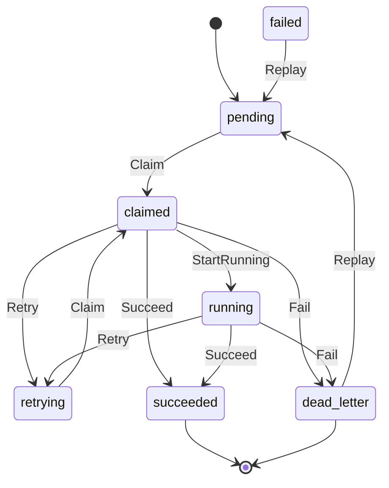

# Queue

## Purpose

`queue` defines the durable Go work-item contracts shared by the projector,
reducer, and replay paths. It models one queue row's lifecycle — pending
through running to succeeded or dead-letter — along with the bounded retry and
failure metadata that operators use to diagnose and recover stuck work.

## Ownership boundary

Owns the work-item value type, the `WorkItemStatus` enum and its constants,
the transition methods, and the retry and failure record carriers. The
Postgres-backed claim, lease, and visibility operations live in
`internal/storage/postgres`. This package has no I/O.

## Status state machine

`StatusFailed` (`"failed"`) is a deprecated legacy terminal state retained so
old rows can still be replayed. New code reaches terminal failure through
`Fail`, which writes `StatusDeadLetter`.

## Exported surface

- `WorkItem` — the durable row shape. Transitions: `Claim`, `StartRunning`,
  `Retry`, `Fail`, `Succeed`, `Replay`. Also: `ScopeGenerationKey` returns the
  `scopeID:generationID` boundary string.
- `WorkItemStatus` — string alias for the status enum.
- Status constants: `StatusPending`, `StatusClaimed`, `StatusRunning`,
  `StatusRetrying`, `StatusSucceeded`, `StatusDeadLetter`, `StatusFailed`
  (deprecated).
- `RetryState` — bounded retry timing: `AttemptCount`, `LastAttemptAt`,
  `NextAttemptAt`.
- `FailureRecord` — durable failure classification: `FailureClass`, `Message`,
  `Details`.

See `doc.go` for the full godoc contract.

## Dependencies

Standard library only (`errors`, `fmt`, `time`).

## Telemetry

This package emits no metrics, spans, or logs. Storage adapters and consumer
workers in `internal/storage/postgres`, `internal/projector`, and
`internal/reducer` add telemetry around each transition.

## Gotchas / invariants

- Every transition method clones the receiver and returns a new `WorkItem`. The
  original is not mutated. Callers must persist the returned value.
- `Claim` requires a positive lease duration and a status of `StatusPending` or
  `StatusRetrying`. All other statuses return an error.
- `Retry` requires `nextAttempt` to be at or after `now`; passing an earlier
  time returns an error.
- `Replay` resets `AttemptCount` to zero. Operators that invoke replay accept
  that the retry budget restarts from scratch.
- `StatusFailed` is retained only so legacy rows can be replayed via `Replay`.
  Do not produce new rows in this state; use `Fail` instead, which writes
  `StatusDeadLetter`.
- `WorkItem.VisibleAt` and `ClaimUntil` are set to `nil` by `StartRunning`,
  `Succeed`, and `Fail` to prevent stale visibility timestamps from blocking
  future queue scans.

## Related docs

- `docs/docs/architecture.md` — pipeline and ownership table
- `docs/docs/deployment/service-runtimes.md` — projector and reducer runtime
  lanes
- `go/internal/storage/postgres/` — Postgres-backed claim, lease, and
  visibility adapter
