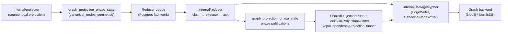
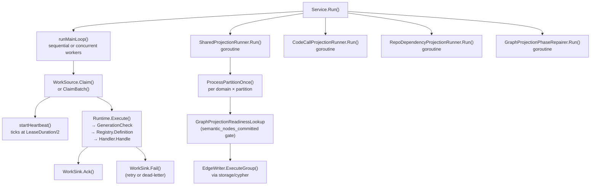

# internal/reducer

`internal/reducer` owns cross-domain materialization, queued repair, and
shared projection that runs after source-local facts have been committed by
the projector. It is the authoritative owner of canonical graph truth for
cross-source and cross-scope domains.

Reducer changes carry the highest correctness risk in the codebase. Wrong
graph truth, query truth, or deployment truth is a product failure. Track the
full path — raw evidence → admitted candidate → projected row → graph write →
query surface — before changing ordering, admission, retries, or
backend-specific behavior. See CLAUDE.md "Correlation Truth Gates".

## Where this fits in the pipeline



## Internal flow



## Domain catalog

All twelve reducer domains are declared in `domain.go` and registered via
`NewDefaultRuntime` / `NewDefaultRegistry` in `defaults.go`. Each domain has an
`OwnershipShape` enforcing cross-source, cross-scope, and canonical-write
requirements.

| Domain constant | Summary |
| --- | --- |
| `DomainWorkloadIdentity` | Resolve canonical workload identity across sources |
| `DomainDeployableUnitCorrelation` | Correlate cross-source deployable-unit evidence before workload admission |
| `DomainCloudAssetResolution` | Resolve canonical cloud asset identity across sources |
| `DomainDeploymentMapping` | Materialize platform bindings across sources |
| `DomainDataLineage` | Resolve lineage across sources and scopes |
| `DomainOwnership` | Resolve ownership and responsibility records |
| `DomainGovernance` | Resolve governance and policy attribution |
| `DomainWorkloadMaterialization` | Materialize canonical workload graph nodes |
| `DomainCodeCallMaterialization` | Materialize canonical code-call edges |
| `DomainSemanticEntityMaterialization` | Materialize Annotation, Typedef, TypeAlias, Component semantic nodes |
| `DomainSQLRelationshipMaterialization` | Materialize canonical SQL relationship edges |
| `DomainInheritanceMaterialization` | Materialize inheritance, override, and alias edges |

## Intent lifecycle

`Intent` (declared in `intent.go:104`) carries the durable queue contract.
States: `pending` → `claimed` → `running` → `succeeded` / `failed`.

- `IntentStatusPending`, `IntentStatusClaimed`, `IntentStatusRunning`,
  `IntentStatusSucceeded`, `IntentStatusFailed` — `intent.go:51–61`.
- `ResultStatusSucceeded`, `ResultStatusFailed`, `ResultStatusSuperseded` —
  `intent.go:69–75`.
- `ResultStatusSuperseded` short-circuits execution when
  `GenerationCheck` confirms a newer generation is active for the scope.

## Queue claim / execute / ack loop

`Service` (declared in `service.go:54`) coordinates the main loop:

- **Sequential** (`Workers <= 1`): `Claim` → `executeWithTelemetry` →
  `Ack` or `Fail` in order.
- **Concurrent** (`Workers > 1`): N goroutines compete. When `WorkSource`
  implements `BatchWorkSource` and `WorkSink` implements `BatchWorkSink`,
  the batch path reduces Postgres round-trips.
- **Heartbeat**: `startHeartbeat` (`service.go:409`) spawns a goroutine
  that calls `Heartbeat` at `HeartbeatInterval`; the heartbeat is stopped
  before `Ack` or `Fail` to avoid lease extension after the transaction
  commits.

`Service.Run` also starts `SharedProjectionRunner`, `CodeCallProjectionRunner`,
`RepoDependencyProjectionRunner`, and `GraphProjectionPhaseRepairer` as
concurrent goroutines. Any runner error cancels the shared context.

## Graph projection phase coordination

`graph_projection_phase_state` is the durable readiness coordination table.
Phases and keyspaces are declared in `graph_projection_phase.go`.

Key phases:

| Phase constant | Meaning |
| --- | --- |
| `GraphProjectionPhaseCanonicalNodesCommitted` | Projector canonical node writes committed |
| `GraphProjectionPhaseSemanticNodesCommitted` | Semantic entity reducer writes committed |
| `GraphProjectionPhaseDeployableUnitCorrelation` | Deployable-unit correlation pass finished |
| `GraphProjectionPhaseDeploymentMapping` | `deployment_mapping` domain finished one bounded slice |
| `GraphProjectionPhaseWorkloadMaterialization` | `workload_materialization` domain finished |
| `GraphProjectionPhaseCrossSourceAnchorReady` | Reserved for DSL cross-source anchor publication |

`GraphProjectionPhasePublisher` (interface at `graph_projection_phase.go:117`)
is the only write path for phase rows. Use `publishIntentGraphPhase`
(`graph_projection_phase_publish.go`) inside handlers rather than calling the
publisher directly.

`GraphProjectionPhaseRepairQueue` (`graph_projection_phase_repair.go:36`) and
`GraphProjectionPhaseRepairer` (`graph_projection_phase_repair_runner.go:58`)
handle the case where a graph write commits but the subsequent phase
publication fails; the repairer retries exact rows durably.

## Shared projection runner

`SharedProjectionRunner` (`shared_projection_runner.go:95`) iterates all
shared-projection domains and all partitions each cycle, calling
`ProcessPartitionOnce` for each domain/partition pair. Domains processed:
`platform_infra`, `workload_dependency`, `inheritance_edges`,
`sql_relationships`.

The runner uses exponential back-off (doubling each empty cycle, capped at
`5s`) to avoid sustained high-frequency polling during idle periods. When
intents are blocked on a readiness phase (`BlockedReadiness > 0`), it
re-polls at the base interval without backing off.

Configuration via `LoadSharedProjectionConfig` reads
PCG_SHARED_PROJECTION_* env vars; see `cmd/reducer/README.md`.

## Facts-First Bootstrap Ordering

The bootstrap pipeline in `go/cmd/bootstrap-index/main.go` enforces a
multi-pass ordering that the reducer must honor:

```text
Phase 1 — Collection + First-Pass Reduction
  Projector drains and emits canonical nodes. deployment_mapping can remain
  pending because resolved_relationships do not yet exist.

Phase 2 — Backfill
  BackfillAllRelationshipEvidence() (bootstrap-index/main.go:236)
  populates relationship_evidence_facts and publishes readiness rows.

Phase 3 — Deployment Mapping Reopen
  ReopenDeploymentMappingWorkItems() (bootstrap-index/main.go:273)
  reopens deployment_mapping so the reducer can create resolved_relationships.

Phase 4 — Second-Pass Consumers
  Any domain consuming resolved_relationships must have a re-trigger
  mechanism after Phase 3.
```

**Critical rule**: any reducer domain or sub-package that consumes
`resolved_relationships` must have a post-Phase-3 reopen or re-trigger
mechanism. Adding a new consumer without that mechanism creates an E2E-only
bug that is invisible in unit and integration tests.

## Exported surface

Core interfaces:

- `WorkSource`, `Executor`, `WorkSink`, `WorkHeartbeater` — `service.go:22–40`
- `BatchWorkSource`, `BatchWorkSink` — `service.go:43–51`
- `Handler`, `HandlerFunc` — `registry.go:70–78`
- `GraphProjectionPhasePublisher` — `graph_projection_phase.go:117`
- `GraphProjectionPhaseRepairQueue` — `graph_projection_phase_repair.go:36`
- `GraphProjectionPhaseStateLookup` — `graph_projection_phase_repair_runner.go:25`

Key construction functions:

- `NewDefaultRuntime(DefaultHandlers)` — `defaults.go:102` — one-call wiring
  for the standard domain catalog.
- `NewDefaultRegistry(DefaultHandlers)` — `defaults.go:86` — registry only.
- `NewRuntime(Registry)` — `runtime.go:63` — bare runtime over a custom registry.
- `LoadSharedProjectionConfig(getenv)` — `shared_projection_runner.go:476`.
- `BuildSharedProjectionIntent(input)` — `shared_projection.go:53` — stable
  SHA256 intent ID matching the Python implementation.
- `BuildProjectionRows`, `BuildProjectionRowsWithInfrastructurePlatforms` —
  `projection.go:233, 243`.

Domain and intent helpers:

- `ParseDomain(raw)` — `domain.go:24`.
- `IsRetryable(err)` — `intent.go:93`.
- `GraphProjectionPhaseRepairsFromStates` — `graph_projection_phase_repair.go:45`.
- `ExtractOverlayEnvironments` — `projection.go:207`.
- `InferWorkloadKind`, `InferWorkloadClassification` — `projection.go:152, 169`.

## Dependencies

- `internal/storage/cypher` — all canonical graph writes; no direct driver calls.
- `internal/relationships` — evidence kinds consumed by cross-repo resolution
  and provisioning evidence classification (`projection.go:544`).
- `internal/telemetry` — spans, metrics, log attributes.
- `internal/truth` — `truth.Contract`, `truth.Layer` for domain registration.
- `internal/storage/postgres` — Postgres-backed implementations of all
  queue and store interfaces; wired in `cmd/reducer`, not here.

## Telemetry

Spans emitted:

- `SpanReducerRun` — wraps each `executeWithTelemetry` call
  (`service.go:308`).
- `SpanCanonicalWrite` — wraps each `processPartitionWithTelemetry`
  call in `SharedProjectionRunner` (`shared_projection_runner.go:284`).

Key metrics (all prefixed `pcg_dp_`):

- `reducer_run_duration_seconds` — per-intent execution duration, labeled by domain.
- `reducer_queue_wait_duration_seconds` — time from `AvailableAt` to claim start.
- `reducer_executions_total` — intent executions, labeled by domain, queue, status.
- `queue_claim_duration_seconds` — time to acquire one claim from Postgres.
- `shared_projection_cycles_total` — completed shared projection cycles per domain.
- `canonical_write_duration_seconds` — duration of one canonical write cycle.
- `shared_projection_intent_wait_duration_seconds` — per-domain intent queue age.
- `shared_projection_processing_duration_seconds` — per-domain partition processing.
- `shared_projection_step_duration_seconds` — per phase (retract, write, mark_completed).
- `canonical_writes_total` — includes graph-projection repair writes.

Log phase attributes: `telemetry.PhaseReduction` (main loop),
`telemetry.PhaseShared` (shared projection and repair runner).

## Gotchas / invariants

- **All reducer domains must be cross-source, cross-scope, and
  canonical-write** — enforced by `OwnershipShape.Validate` at
  registration (`registry.go:22–33`).
- **Projection must be idempotent** — queue retries, duplicate claims, and
  partial graph writes must converge on the same truth.
- **Generation supersession** — `Runtime.execute` calls `GenerationCheck`
  before dispatching to a handler; stale intents return
  `ResultStatusSuperseded` without touching the graph.
- **`deployment_mapping` requires post-Phase-3 reopen** — the domain
  cannot produce `resolved_relationships` until after
  ReopenDeploymentMappingWorkItems runs in the bootstrap pipeline
  (bootstrap-index/main.go:273).
- **Phase publications and graph writes are not atomic** — if a graph write
  commits but the subsequent `PublishGraphProjectionPhases` call fails, the
  `GraphProjectionPhaseRepairQueue` captures the publication for retry by
  `GraphProjectionPhaseRepairer`. Do not remove the repair queue without
  understanding this failure mode.
- **Edge domain readiness gates** — shared projection domains
  `code_calls`, `sql_relationships`, and `inheritance_edges` gate on
  `canonical_nodes_committed` or `semantic_nodes_committed` being present
  before writing edges (`shared_projection.go:91–99`).
- **`BuildSharedProjectionIntent` produces a stable SHA256 ID** —
  changing any of the identity fields breaks idempotency for in-flight
  intents (`shared_projection.go:59–66`).

## Related docs

- `docs/docs/architecture.md`
- `docs/docs/deployment/service-runtimes.md`
- `docs/docs/reference/telemetry/index.md`
- `docs/docs/reference/local-testing.md`
- `go/cmd/reducer/README.md`
- `go/internal/projector/README.md` (upstream handoff)
- `go/internal/reducer/dsl/README.md`
- `go/internal/reducer/aws/README.md`
- `go/internal/reducer/tags/README.md`
- `go/internal/reducer/tfstate/README.md`
