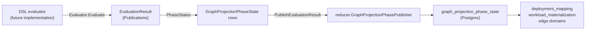

# internal/reducer/dsl

`reducer/dsl` defines the cross-source DSL evaluation seam and the helpers
that convert an `EvaluationResult` into durable graph-projection phase rows.
The package owns the contract; it does not own an evaluator implementation.

## Where this fits in the pipeline

## Purpose

Pin two contracts:

1. The accepted DSL reducer scaffold (`RuntimeContract`) — the four components
   and five readiness checkpoints the DSL substrate is expected to own.
2. The evaluator seam (`Evaluator`, `DriftEvaluator`), the publication shape
   (`Publication`, `EvaluationResult`), and the result-to-phase helpers
   (`PhaseStates`, `PublishEvaluationResult`).

## Ownership boundary

- Owns: the scaffold contract, the `Evaluator` and `DriftEvaluator` seams,
  `Publication` / `EvaluationResult` shapes, and the result-to-phase
  conversion plus publish helper.
- Does not own: an evaluator implementation. Concrete DSL substrates land
  elsewhere.
- Does not write to the graph. Phase rows are forwarded through
  `reducer.GraphProjectionPhasePublisher`, wired by the parent reducer.

## Exported surface

### Scaffold

- `PublishedCheckpoint{Keyspace, Phase}` — `contract.go:13`.
- `RuntimeContract{Components, Checkpoints}` — `contract.go:19`.
- `RuntimeContract.Validate` — `contract.go:70`.
- `DefaultRuntimeContract()` — `contract.go:56` — defensive copy.
- `RuntimeContractTemplate()` — `contract.go:64` — alias for
  `DefaultRuntimeContract`.

Accepted scaffold: four components (`evaluator`, `drift_evaluator`,
`deployment_mapping`, `workload_materialization`) and five checkpoints:

| Keyspace | Phase |
| --- | --- |
| `terraform_resource_uid` | `cross_source_anchor_ready` |
| `cloud_resource_uid` | `cross_source_anchor_ready` |
| `webhook_event_uid` | `cross_source_anchor_ready` |
| `service_uid` | `deployment_mapping` |
| `service_uid` | `workload_materialization` |

### Evaluator seam

- `OutputKind` — `evaluator.go:13`; values `OutputKindResolvedRelationship`,
  `OutputKindDriftObservation`.
- `Publication{AcceptanceUnitID, Keyspace, Phase, OutputKind}` —
  `evaluator.go:27`; `Validate` at `evaluator.go:59`.
- `EvaluationResult{Publications}` — `evaluator.go:36`; `Validate` at
  `evaluator.go:76`; `PhaseStates` at `evaluator.go:87`.
- `Evaluator` interface — `evaluator.go:41`.
- `DriftEvaluator` interface — `evaluator.go:46`.
- `CanonicalView{ScopeID, GenerationID, CollectorKind}` — `evaluator.go:51`.
- `PublishEvaluationResult(ctx, publisher, scopeID, generationID, result,
  observedAt)` — `evaluator.go:155`.

## Dependencies

- `go/internal/reducer` — `GraphProjectionKeyspace`, `GraphProjectionPhase`,
  `GraphProjectionPhaseKey`, `GraphProjectionPhaseState`,
  `GraphProjectionPhasePublisher`.

## Telemetry

The package itself does not emit metrics or spans. Callers wrap
`PublishEvaluationResult` with their own telemetry. Shared instruments are
in `go/internal/telemetry/instruments.go`.

## Gotchas / invariants

- **`OutputKindResolvedRelationship` feeds `resolved_relationships`** —
  the row that other reducer domains consume. Per CLAUDE.md "Facts-First
  Bootstrap Ordering", the bootstrap pipeline reopens `deployment_mapping`
  work items in Phase 3 after backfill
  (`bootstrap-index/main.go:273`). Any new domain that consumes
  `resolved_relationships` must have its own post-Phase-3 reopen; this
  package does not provide it.
- **`PhaseStates` deduplicates by `(AcceptanceUnitID, Keyspace, Phase)`** —
  `evaluator.go:108–126`; identical publications in one `EvaluationResult`
  produce only one phase row. Deduplication is for replay stability.
- **`PhaseStates` sorts the output** — `evaluator.go:140–149` by
  `(AcceptanceUnitID, Keyspace, Phase)`; callers must not assume insertion
  order.
- **`cross_source_anchor_ready` is reserved for the DSL layer** —
  `GraphProjectionPhaseCrossSourceAnchorReady` is defined in
  `internal/reducer/graph_projection_phase.go`; do not publish this phase
  from canonical projectors or other reducer handlers.
- **`PublishEvaluationResult` is a no-op when `publisher` is nil or when
  the result produces zero phase states** — `evaluator.go:163–168`.
- **Zero `observedAt` falls back to `time.Now().UTC()`** — `PhaseStates`
  calls `Validate` at `evaluator.go:87` before normalizing the timestamp.

## Related docs

- `docs/docs/architecture.md`
- `go/internal/reducer/README.md`
- `go/internal/reducer/aws/README.md`
- `go/internal/reducer/tfstate/README.md`
