# internal/reducer/tags

`reducer/tags` defines the tag-normalization seam and the helpers that
publish canonical-cloud readiness rows once normalization completes. The
package owns the contract; it does not own a concrete normalizer.

## Where this fits in the pipeline

```mermaid
flowchart LR
  TagSource["Cloud resource\nobserver (future)"] -->|ObservationBatch| Normalizer["Normalizer.Normalize()"]
  Normalizer --> Result["NormalizationResult\n{Resources}"]
  Result -->|PhaseStates| PhaseRows["cloud_resource_uid\ncanonical_nodes_committed rows"]
  PhaseRows -->|PublishNormalizationResult| Publisher["reducer.GraphProjectionPhasePublisher"]
  Publisher --> PhaseTable["graph_projection_phase_state\n(Postgres)"]
  PhaseTable --> DownstreamEdges["DSL evaluator\nedge domains"]
```

## Purpose

Pin two contracts:

1. The accepted tag-normalization scaffold (`RuntimeContract`) — the
   `normalizer` component and the `cloud_resource_uid` keyspace it owns.
2. The `Normalizer` seam, the `ObservationBatch` input shape, the
   `NormalizationResult` output shape, and the helpers that convert and
   publish phase rows.

## Ownership boundary

- Owns: the scaffold contract, the `Normalizer` seam, the observation and
  result shapes, and the result-to-phase conversion plus publish helper.
- Does not own: a concrete normalizer. The substrate lands elsewhere.
- Does not write to the graph. Phase rows go through
  `reducer.GraphProjectionPhasePublisher`.

## Exported surface

### Scaffold

- `RuntimeContract{Components, CanonicalKeyspaces}` — `contract.go:14`.
- `RuntimeContract.Validate` — `contract.go:41`.
- `DefaultRuntimeContract()` — `contract.go:27` — defensive copy.
- `RuntimeContractTemplate()` — `contract.go:34` — alias for
  `DefaultRuntimeContract`.

Accepted scaffold: one component (`normalizer`), one canonical keyspace
(`cloud_resource_uid`).

### Seam

- `Normalizer` interface — `normalizer.go:14`; `Normalize(ctx, ObservationBatch)`
  returns `(NormalizationResult, error)`.
- `ObservationBatch{ScopeID, GenerationID, Resources}` — `normalizer.go:19`.
- `ObservedResource{CanonicalResourceID, RawTags}` — `normalizer.go:26`.
- `NormalizedResource{CanonicalResourceID, NormalizedTags}` — `normalizer.go:33`.
- `NormalizationResult{Resources}` — `normalizer.go:39`; `Validate` at
  `normalizer.go:47`; `PhaseStates` at `normalizer.go:58`.
- `PublishNormalizationResult(ctx, publisher, scopeID, generationID, result,
  observedAt)` — `normalizer.go:108`.

## Dependencies

- `go/internal/reducer` — `GraphProjectionPhaseKey`,
  `GraphProjectionPhaseState`, `GraphProjectionPhasePublisher`,
  `GraphProjectionKeyspaceCloudResourceUID`,
  `GraphProjectionPhaseCanonicalNodesCommitted`.

## Telemetry

The package does not emit metrics or spans. Callers wrap
`PublishNormalizationResult` with their own telemetry.

## Gotchas / invariants

- **Phase 1 only** — `PhaseStates` always publishes `(cloud_resource_uid,
  canonical_nodes_committed)` per resource (`normalizer.go:86–97`). This is
  a Phase 1 publication; downstream domains that consume
  `resolved_relationships` derived from these canonical rows still require
  the post-Phase-3 reopen mechanism from CLAUDE.md "Facts-First Bootstrap
  Ordering". This package does not own that reopen.
- **`PhaseStates` deduplicates by `CanonicalResourceID`** — `normalizer.go:79–85`;
  duplicate resources in one `NormalizationResult` produce only one phase row.
- **`PhaseStates` sorts the output by `AcceptanceUnitID`** —
  `normalizer.go:100–103`; output order is deterministic.
- **`PhaseStates` requires non-blank `scopeID` and `generationID`** —
  `normalizer.go:63–69`.
- **Zero `observedAt` falls back to `time.Now().UTC()`** — `normalizer.go:72`.
- **`PublishNormalizationResult` is a no-op when `publisher` is nil or the
  result produces zero phase states** — `normalizer.go:112–115`.

## Related docs

- `docs/docs/architecture.md`
- `go/internal/reducer/README.md`
- `go/internal/reducer/aws/README.md`
- `go/internal/reducer/dsl/README.md`
