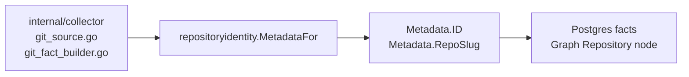

# Repositoryidentity

## Purpose

`repositoryidentity` is the single home for canonical repository identity.
Collectors, fact builders, and graph writers all derive the same
`repository:r_<8-hex>` ID and `org/repo` slug from the same remote URL
plus local path inputs. Keeping these derivations in one package prevents
divergence between the ID used to write graph nodes and the ID recorded in
durable facts.

## Where this fits

## Ownership boundary

`repositoryidentity` owns remote URL normalization, slug extraction, and
canonical ID hashing for git-style repos. It does not own fact emission,
graph writes, or collection scheduling. Those belong to `internal/collector`
and `internal/projector`. This package has no internal-package imports and
no runtime state.

## Exported surface

- `Metadata` — canonical repository identity value: `ID`, `Name`, `RepoSlug`,
  `RemoteURL`, `LocalPath`, `HasRemote`.
- `MetadataFor(name, localPath, remoteURL string) (Metadata, error)` — resolves
  `localPath` with `filepath.Abs`, normalizes `remoteURL`, derives the slug
  and ID, and returns a fully populated `Metadata`. Returns an error when
  `filepath.Abs` fails or when `CanonicalRepositoryID` cannot produce an ID.
- `NormalizeRemoteURL(remoteURL string) string` — collapses SSH
  (`git@host:org/repo.git`) and HTTPS (`https://host/org/repo`) forms to
  lowercase `https://host/org/repo`. Strips trailing `.git` and trailing
  slashes.
- `RepoSlugFromRemoteURL(remoteURL string) string` — returns the `org/repo`
  path from the normalized HTTPS form. Returns empty string when the URL is
  empty or cannot be parsed.
- `CanonicalRepositoryID(remoteURL, localPath string) (string, error)` —
  hashes the normalized remote URL when present, falls back to `localPath`.
  Returns an error when both are empty. Format: `repository:r_<8-hex-sha1>`.

See `doc.go` for the godoc contract.

## Dependencies

Standard library only (`crypto/sha1`, `encoding/hex`, `fmt`, `net/url`,
`path/filepath`, `strings`). No internal packages.

## Telemetry

None. Callers record the derived `ID` in their own structured log fields and
fact payloads.

## Gotchas / invariants

- `CanonicalRepositoryID` (`identity.go:105`) requires a non-empty `localPath`
  when `remoteURL` is absent. Passing both empty returns an error rather than
  an empty or zero-value ID.
- `NormalizeRemoteURL` (`identity.go:51`) lowercases the host and path, strips
  `.git` suffix, and drops trailing slashes. SSH `git@github.com:org/repo.git`
  and HTTPS `https://github.com/org/repo.git` produce the same canonical URL.
- The hash is SHA-1 truncated to 8 hex characters. It is identity-stable
  across source builds but not cryptographically authoritative.
- `MetadataFor` resolves `localPath` via `filepath.Abs` (`identity.go:28`).
  Callers must pass paths in the form intended to be canonical: no trailing
  slashes, no relative segments.
- The `ID` prefix `repository:r_` is part of the canonical format. Graph
  node MERGE and fact payload consumers expect this exact prefix.

## Related docs

- `docs/docs/architecture.md` — pipeline and ownership table
- `go/internal/collector/README.md` — callers that build `Metadata` during
  repository discovery
