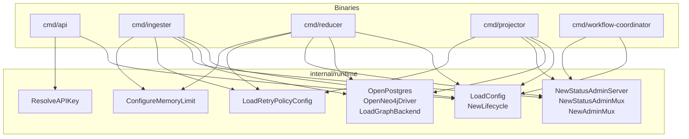
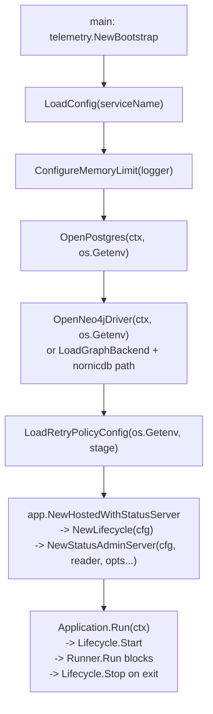

# Runtime

## Purpose

`runtime` owns the shared process wiring used by every PCG binary at startup.
It provides: admin HTTP muxes, health and readiness probes, status metrics
endpoints, data-store configuration and connection helpers, retry policy
defaults, memory limit tuning, API key resolution, and recovery admin routes.
No binary implements this wiring on its own; each calls the helpers here.

## Where this fits in the pipeline

Every binary that hosts long-running work also passes through `internal/app`
which calls `NewLifecycle` and optionally `NewStatusAdminServer` on behalf of
the binary's main function.

## Internal flow

The call sequence for a typical long-running binary (`cmd/ingester`,
`cmd/reducer`, `cmd/projector`):

`NewStatusAdminServer` delegates to `NewStatusAdminMux`, which calls
`NewAdminMux` to mount `/healthz`, `/readyz`, `/admin/status`, and `/metrics`.
When `WithRecoveryHandler` is passed, `RecoveryHandler.Mount` adds
`/admin/replay` and `/admin/refinalize` to the same mux.

## Lifecycle / workflow

`Lifecycle` (from `lifecycle.go:20`) holds `ServiceName` and a
`telemetry.Bootstrap`. Its `Start` method validates the bootstrap contract;
its `Run` method blocks until the context is canceled via `ContextRunner`.
`HTTPServer` (from `http_server.go:23`) also satisfies the Lifecycle
interface defined in `internal/app` — `Start` opens the TCP listener and
serves in the background; `Stop` gracefully drains with a configurable
`ShutdownTimeout` (default 5 s).

ComposeLifecycles in `internal/app` chains multiple Lifecycle values
(including `HTTPServer` instances) into one ordered start/stop chain.

## Exported surface

### Config and env helpers

- `Config` — `ServiceName`, `Command`, `ListenAddr`, `MetricsAddr`; built by
  `LoadConfig(serviceName)` which reads `PCG_LISTEN_ADDR` (default
  `0.0.0.0:8080`) and `PCG_METRICS_ADDR` (default `0.0.0.0:9464`)
- `LoadConfig(serviceName)` — validates and returns a `Config`; fails if any
  field is blank

### Data-store helpers

- `GraphBackend` — string type; constants `GraphBackendNeo4j` (`"neo4j"`) and
  `GraphBackendNornicDB` (`"nornicdb"`); `LoadGraphBackend` reads
  `PCG_GRAPH_BACKEND`, empty defaults to `nornicdb`, invalid values fail at
  startup
- `PostgresConfig` / `PostgresPoolSetter` — config struct and interface for
  pool tuning; loaded by `LoadPostgresConfig` from `PCG_FACT_STORE_DSN`,
  `PCG_CONTENT_STORE_DSN`, or `PCG_POSTGRES_DSN` plus optional pool knobs
- `Neo4jConfig` — driver and pool tuning; loaded by `LoadNeo4jConfig` from
  `PCG_NEO4J_URI` / `NEO4J_URI`, `PCG_NEO4J_USERNAME` / `NEO4J_USERNAME`,
  `PCG_NEO4J_PASSWORD` / `NEO4J_PASSWORD`, and optional pool knobs
- `OpenPostgres(ctx, getenv)` — opens, tunes via `ConfigurePostgresPool`, and
  pings a Postgres connection; returns `*sql.DB`
- `OpenNeo4jDriver(ctx, getenv)` — opens a Neo4j/NornicDB Bolt driver,
  applies `ApplyNeo4jConfig`, verifies connectivity; returns
  `neo4jdriver.DriverWithContext`
- `ConfigurePostgresPool(target, cfg)` — applies `PostgresConfig` to any
  `PostgresPoolSetter`
- `ApplyNeo4jConfig(target, cfg)` — applies `Neo4jConfig` to a
  `*neo4jconfig.Config`

### Admin and HTTP surfaces

- `AdminMuxConfig` / `NewAdminMux` — builds `/healthz`, `/readyz`,
  `/admin/status`, `/metrics` routes; optionally mounts a
  `RecoveryHandler`; service name required
- `HTTPServer` / `HTTPServerConfig` / `NewHTTPServer` — one HTTP server with
  Start/Stop lifecycle; `Addr()` returns the bound address after Start
- `NewStatusAdminServer(cfg, reader, opts...)` — admin `HTTPServer` backed by
  the status reader; used by all long-running binaries
- `NewStatusMetricsServer(cfg, reader, opts...)` — optional dedicated metrics
  `HTTPServer` when `MetricsAddr` differs from `ListenAddr`; returns `nil`
  when `MetricsAddr` is empty
- `NewStatusAdminMux` — lower-level mux builder; combines status handler,
  metrics handler, optional recovery routes, and optional app handler
- `NewStatusMetricsHandler(serviceName, reader)` — Prometheus-style text handler
- `NewCompositeMetricsHandler(statusHandler, prometheusHandler)` — merges
  hand-rolled runtime gauges and OTEL Prometheus output at `/metrics`
- `StatusAdminOption` — option type; constructors: `WithRecoveryHandler`,
  `WithPrometheusHandler`

### Recovery admin

- `RecoveryHandler` / `NewRecoveryHandler(handler)` — mounts `/admin/replay`
  (POST) and `/admin/refinalize` (POST) on the admin mux; delegates to
  `recovery.Handler`; replaces the Python write-plane admin surface

### Lifecycle and observability

- `Lifecycle` / `NewLifecycle(cfg)` — validates `Config`, initializes
  `telemetry.Bootstrap`, provides Start / Run / Stop
- `ContextRunner` — zero-value struct; blocks until context is canceled;
  used when a binary has no long-running body of its own
- `Observability` / `NewObservability()` — snapshots `telemetry.MetricDimensionKeys`,
  `telemetry.SpanNames`, `telemetry.LogKeys` at construction time

### Retry policy

- `RetryPolicyConfig` — `MaxAttempts` and `RetryDelay`
- `LoadRetryPolicyConfig(getenv, stagePrefix)` — reads
  `PCG_{STAGE}_MAX_ATTEMPTS` (default `3`) and `PCG_{STAGE}_RETRY_DELAY`
  (default `30s`); both must be positive; stage prefix is required

### Memory limits

- `ConfigureMemoryLimit(logger)` — sets `GOMEMLIMIT` from cgroup memory ×
  `DefaultMemLimitRatio` (0.70), floor `MinMemLimit` (512 MiB);
  unconditionally sets `GODEBUG=madvdontneed=1`; respects explicit
  `GOMEMLIMIT` env var as highest priority

### API key

- `ResolveAPIKey(getenv)` — resolution order: explicit `PCG_API_KEY` env,
  then persisted `PCG_HOME/.env`, then auto-generated 32-byte hex token when
  `PCG_AUTO_GENERATE_API_KEY` is truthy; uses file-lock before writing

### Status requests

- `StatusRequestStore` — interface for durable scan/reindex lifecycle ops
- `StatusRequestHandler` / `NewStatusRequestHandler(store)` — manages
  `RequestScan`, `ClaimScan`, `CompleteScan`, `RequestReindex`,
  `ClaimReindex`, `CompleteReindex`
- `RequestState` — `idle`, `pending`, `running`, `completed`, `failed`
- `ScanRequest` / `ReindexRequest` — lifecycle state structs

## Dependencies

| Package | Used for |
| --- | --- |
| `internal/buildinfo` | `AppVersion()` in runtime metrics labels |
| `internal/recovery` | `recovery.Handler` backing `RecoveryHandler` |
| `internal/status` | `statuspkg.Reader` for admin and metrics handlers |
| `internal/telemetry` | `Bootstrap`, `MetricDimensionKeys`, `SpanNames`, `LogKeys`, `SkippedRefreshCount`, `DefaultServiceNamespace` |

## Telemetry

This package emits no OTEL spans or traces of its own. The metrics endpoint
at `/metrics` exposes hand-rolled Prometheus-style gauges derived from the
`statuspkg.Reader`. Metric names (all `pcg_runtime_` prefix):

- `pcg_runtime_info` — binary identity labels (service name, namespace, version)
- `pcg_runtime_scope_active`, `pcg_runtime_scope_changed`, `pcg_runtime_scope_unchanged`
- `pcg_runtime_refresh_skipped_total`
- `pcg_runtime_retry_policy_max_attempts`, `pcg_runtime_retry_policy_retry_delay_seconds`
- `pcg_runtime_health_state` — labeled `state` (healthy/progressing/degraded/stalled)
- `pcg_runtime_queue_total`, `pcg_runtime_queue_outstanding`, and queue depth gauges
- `pcg_runtime_stage_items` — labeled by `stage` and `status`
- `pcg_runtime_domain_outstanding` and per-domain backlog gauges
- `pcg_runtime_coordinator_*` — coordinator claim and completeness counters

When `WithPrometheusHandler` is set, `NewCompositeMetricsHandler` appends OTEL
Prometheus output after the hand-rolled gauges at the same `/metrics` endpoint.

## Operational notes

- `/healthz` returns `200 OK` unconditionally when no `AdminCheck` is wired.
  `/readyz` is backed by statusReadinessCheck, which calls
  `statuspkg.Reader.ReadStatusSnapshot`; a failed read returns `503`.
- `pcg_runtime_queue_oldest_outstanding_age_seconds` aging means workers
  cannot keep up with ingest rate; investigate worker count and graph backend
  latency before changing pool sizes.
- `pcg_runtime_health_state{state="stalled"}` = 1 means the pipeline is not
  making progress; check structured logs and failure_class before restarting.
- Admin endpoints have no authentication. They must be bound to the admin port
  (default `0.0.0.0:9464`) and not exposed on the public API port.
- `compose_defaults_test.go` enforces that `docker-compose.yaml` sets
  `PCG_GRAPH_BACKEND=nornicdb` for all graph runtime services and that the
  telemetry overlay is never mixed into a run without an explicit base file.

## Extension points

- `StatusAdminOption` — add new admin mux behavior by defining a new
  `WithPrometheusHandler`-style constructor returning a `StatusAdminOption`;
  do not mutate `AdminMuxConfig` directly
- `PostgresPoolSetter` — any `*sql.DB`-like type satisfies the interface;
  use `ConfigurePostgresPool` to apply shared defaults without forking the
  tuning logic
- `AdminMuxConfig.Health` and `AdminMuxConfig.Ready` — supply custom
  `AdminCheck` functions to gate the probes on domain-specific invariants

## Gotchas / invariants

- `LoadGraphBackend` with an unrecognized value fails at startup, not at
  first use. `data_stores.go:90` is the only valid switch for the backend
  env var; do not add new backend strings without updating this switch and
  the NornicDB ADR.
- `OpenNeo4jDriver` returns an error when `PCG_GRAPH_BACKEND` is not
  `neo4j` or `nornicdb` (`data_stores.go:290`). Both backends use the same
  Bolt driver path.
- `NewStatusMetricsServer` returns `(nil, nil)` when `MetricsAddr` is empty.
  Callers must handle the nil return; MountStatusServer in `internal/app`
  checks this.
- `ConfigureMemoryLimit` is a no-op when `GOMEMLIMIT` is already set as an
  env var; it logs the existing value and returns 0. Do not call it twice.
- Admin routes are not authenticated by this package. If the admin port is
  exposed outside a pod, the operator is responsible for network controls.

## Related docs

- `docs/docs/deployment/service-runtimes.md`
- `docs/docs/deployment/docker-compose.md`
- `docs/docs/reference/telemetry/index.md`
- `docs/docs/reference/local-testing.md`
- ADR: `docs/docs/adrs/2026-04-22-nornicdb-graph-backend-candidate.md`
- ADR: `docs/docs/adrs/2026-04-20-embedded-local-backends-implementation-plan.md`
