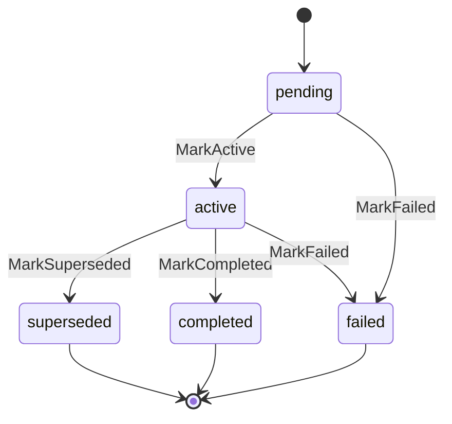

# Scope

## Purpose

`scope` defines the durable identity for source-local scopes and the lifecycle
of their generations. Every fact, work item, and graph projection in PCG is
anchored to an `IngestionScope` and a `ScopeGeneration`. Without these types,
the pipeline cannot determine which source produced an observation or whether
it belongs to the current authoritative snapshot.

## Ownership boundary

Owns scope identity enums (`ScopeKind`, `CollectorKind`, `TriggerKind`), the
generation lifecycle enum (`GenerationStatus`) and its transition table, and
the `IngestionScope` and `ScopeGeneration` value types with their validation
and transition methods. Postgres rows for scopes and generations live in
`internal/storage/postgres` and use these types as their in-memory shape.

## Generation lifecycle

`GenerationStatusSuperseded`, `GenerationStatusCompleted`, and
`GenerationStatusFailed` are terminal. `GenerationStatus.IsTerminal` reports
this. `TransitionTo` enforces the table; forbidden transitions return an error.

## Exported surface

**Enums**

- `ScopeKind` — `KindRepository`, `KindAccount`, `KindRegion`, `KindCluster`,
  `KindStateSnapshot`, `KindEventTrigger`
- `CollectorKind` — `CollectorGit`, `CollectorAWS`, `CollectorTerraformState`,
  `CollectorWebhook`
- `TriggerKind` — `TriggerKindSnapshot`
- `GenerationStatus` — `GenerationStatusPending`, `GenerationStatusActive`,
  `GenerationStatusSuperseded`, `GenerationStatusCompleted`,
  `GenerationStatusFailed`; methods: `Validate`, `IsTerminal`

**Types**

- `IngestionScope` — source-local scope identity: `ScopeID`, `SourceSystem`,
  `ScopeKind`, `ParentScopeID`, `CollectorKind`, `PartitionKey`,
  `ActiveGenerationID`, `PreviousGenerationExists`, `Metadata`. Methods:
  `Validate`, `HasPriorGeneration`, `MetadataCopy`.
- `ScopeGeneration` — one observed snapshot: `GenerationID`, `ScopeID`,
  `ObservedAt`, `IngestedAt`, `Status`, `TriggerKind`, `FreshnessHint`.
  Methods: `Validate`, `ValidateForScope`, `IsTerminal`, `CanTransitionTo`,
  `TransitionTo`, `MarkActive`, `MarkCompleted`, `MarkSuperseded`, `MarkFailed`.

See `doc.go` for the full godoc contract.

## Dependencies

Standard library only (`fmt`, `strings`, `time`).

## Telemetry

This package emits no metrics, spans, or logs.

## Gotchas / invariants

- `PreviousGenerationExists` is the reliable gate for "skip cleanup after a
  failed first attempt." `ActiveGenerationID` is not — a scope whose first
  generation failed never gets an active generation ID, yet still has a prior
  generation row.
- `ScopeGeneration.IngestedAt` must not precede `ObservedAt`. `Validate`
  rejects this ordering.
- `TransitionTo` validates the generation before checking the transition table.
  A generation with blank identifiers or a zero timestamp returns an error from
  `Validate` before the transition check runs.
- `MetadataCopy` returns nil for empty maps. Callers that need a non-nil empty
  map must allocate their own after the copy.
- `IngestionScope.Validate` rejects blank `PartitionKey`. Every scope must have
  a non-blank partition key even when the collector does not use partitioning.
- `ParentScopeID` must differ from `ScopeID` when set. Self-referential parent
  pointers are rejected by `Validate`.

## Related docs

- `docs/docs/architecture.md` — scope and generation identity in the pipeline
- `docs/docs/deployment/service-runtimes.md` — ingester and projector runtime
  lanes
