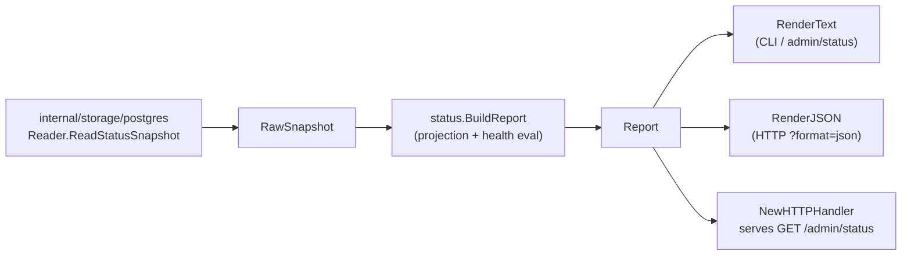

# Status

## Purpose

`status` projects raw Go data-plane runtime counts into operator-facing status
reports. It owns the `Report` type consumed by the CLI, the HTTP admin surface,
and the runtime process-level status view. The package defines the `Reader`
interface that Postgres storage backends implement and provides helpers for
building, rendering, and serving status output in both text and JSON formats.

## Ownership boundary

This package owns: the `Reader` interface and `RawSnapshot` input type; the
projection from `RawSnapshot` to `Report`; health-state derivation
(`evaluateHealth`); text and JSON rendering (`RenderText`, `RenderJSON`); the
`NewHTTPHandler` adapter for operator admin endpoints; and retry-policy
attachment via `WithRetryPolicies`.

It does not own: queue persistence (that belongs to `internal/storage/postgres`),
metric or span emission (that belongs to `internal/telemetry`), or HTTP routing
(that belongs to `internal/query` and `internal/runtime`).

See `CLAUDE.md` §Preserve Service Boundaries for the project-wide ownership
table.

## Internal flow

## Exported surface

See `doc.go` for the godoc contract. Key types and functions:

### Core report types

- `RawSnapshot` — read-only substrate: scope counts, generation counts, stage
  counts, domain backlogs, queue blockages, retry policies, queue snapshot,
  latest failure metadata, and the optional `CoordinatorSnapshot`
- `Report` — operator-facing projection of `RawSnapshot`; the fields below are
  the stable output surface
- `Reader` — one-method interface (`ReadStatusSnapshot`) that storage
  implementations satisfy

### Snapshot sub-types

- `QueueSnapshot` — aggregate queue pressure: total, outstanding, pending,
  in-flight, retrying, succeeded, failed, dead-letter, oldest outstanding age,
  overdue claims
- `QueueFailureSnapshot` — latest failed work item context (stage, domain,
  failure class, message, details); rendered in status payloads, never in
  metric labels
- `QueueBlockage` — conflict-domain-blocked work: stage, domain, conflict
  domain, conflict key, blocked count, oldest age
- `DomainBacklog` — backlog depth for one reducer or projection domain
- `ScopeActivitySnapshot` — active, changed, unchanged scope counts for
  incremental-refresh operator view
- `GenerationHistorySnapshot` — active, pending, completed, superseded, failed,
  other generation counts
- `GenerationTransitionSnapshot` — one recent scope-generation lifecycle row
  with trigger kind, freshness hint, and timestamps
- `RetryPolicySummary` — one stage's bounded retry settings (max attempts,
  retry delay)
- `CoordinatorSnapshot` — optional workflow-coordinator state: collector
  instances, run and work-item status counts, completeness counts, active and
  overdue claims
- `CollectorInstanceSummary` — one configured collector runtime instance

### Projection functions

- `LoadReport(ctx, reader, asOf, opts)` — reads snapshot through `Reader` and
  calls `BuildReport`
- `BuildReport(raw, opts)` — pure projection; derives scope activity and
  generation history from counts when the storage reader does not populate them
  directly; caps domain backlogs to `Options.DomainLimit` (default 5)
- `DefaultOptions()` — stall threshold 10 minutes, domain limit 5

### Health states

`evaluateHealth` maps queue and generation state to one of four operator-visible
states (in priority order):

| State | Condition |
| --- | --- |
| `stalled` | Overdue claims, or outstanding backlog with no in-flight work past `StallAfter` |
| `degraded` | Dead-letter items, failed items, or failed generations present |
| `progressing` | Work queued or in flight |
| `healthy` | No outstanding queue backlog |

### Rendering and serving

- `RenderText(report)` — compact multi-line text for CLI and plain-text admin
  endpoints; includes health, queue, retry policies, scope activity, generation
  history, stage summaries, domain backlogs, queue blockages, coordinator state,
  and flow lanes
- `RenderJSON(report)` — stable JSON payload for machine-readable consumption;
  field names are part of the operator contract
- `NewHTTPHandler(reader, opts)` — returns an `http.Handler` that serves `GET`
  and `HEAD`; accepts `?format=text` or `?format=json`, defaults to text for
  plain requests and JSON when `Accept: application/json` is set

### Retry policy helpers

- `DefaultRetryPolicies()` — projector and reducer defaults (3 attempts, 30 s
  delay)
- `WithRetryPolicies(reader, policies...)` — decorator that attaches static
  retry metadata to any `Reader` without Postgres persistence
- `MergeRetryPolicies(base, overrides...)` — merges policy sets keyed by stage,
  later entries win

### Flow lanes

`FlowSummary` describes three operator-facing lanes in the report: `collector`,
`projector`, and `reducer`. Each lane carries a `Lane`, `Source`, `Progress`,
and `Backlog` field that together give a quick one-line read on each component.

## Dependencies

- `internal/buildinfo` — `AppVersion()` for the version field in rendered output

This package does not import `internal/telemetry`, `internal/storage`, or any
HTTP routing packages. It is imported by `internal/query`, `internal/runtime`,
and the CLI.

## Telemetry

This package emits no metrics or spans. It is itself an operator-facing signal
surface. The `QueueFailureSnapshot` values it carries come from the queue-failure
records that `internal/storage/postgres` reads; those values must not be
promoted to metric labels because they carry high-cardinality message and details
strings.

## Gotchas / invariants

- **JSON shapes are operator contract.** Every exported JSON field name is
  consumed by operators and automation. Changes require coordination with the
  CLI reference doc (`docs/docs/reference/cli-reference.md`) and the HTTP API
  doc (`docs/docs/reference/http-api.md`).
- **`QueueFailureSnapshot` must not appear in metrics.** Its fields (`FailureMessage`,
  `FailureDetails`) can be multi-hundred-character strings from graph backend
  errors. They are bounded to 240 characters in text rendering but are never
  used as metric label values.
- **`CoordinatorSnapshot` is optional.** When the workflow coordinator is not
  wired, `RawSnapshot.Coordinator` is nil and `Report.Coordinator` is nil.
  Callers must nil-check before rendering coordinator lines.
- **`BuildReport` is a pure function.** It can be called in tests without any
  storage dependency. Use it to unit-test health logic, flow summaries, and
  domain backlog ordering.
- **`DomainBacklogs` are capped.** `BuildReport` applies `topDomainBacklogs`
  with `Options.DomainLimit` (default 5) to prevent unbounded output when the
  reducer has many domains.
- **`QueueBlockage` rows use `ConflictKey` for per-item identity.** These rows
  are sorted biggest-and-oldest-first before rendering. The `ConflictKey` field
  is surfaced in text and JSON but must not be added as a metric label.
- **`RetryPolicySummary` is normalized.** Both `cloneRetryPolicies` and
  `MergeRetryPolicies` deduplicate by stage and sort alphabetically before
  returning. Do not rely on insertion order.
- **`evaluateHealth` returns `stalled` before `degraded`.** Overdue claims and
  stalled queues take priority over dead-letter state in the health verdict.

## Related docs

- `docs/docs/reference/cli-reference.md` — `pcg status` command output
- `docs/docs/reference/http-api.md` — `/admin/status` endpoint shape
- `docs/docs/reference/telemetry/index.md` — health vs completeness signal guidance
- `docs/docs/architecture.md` — pipeline and ownership table
