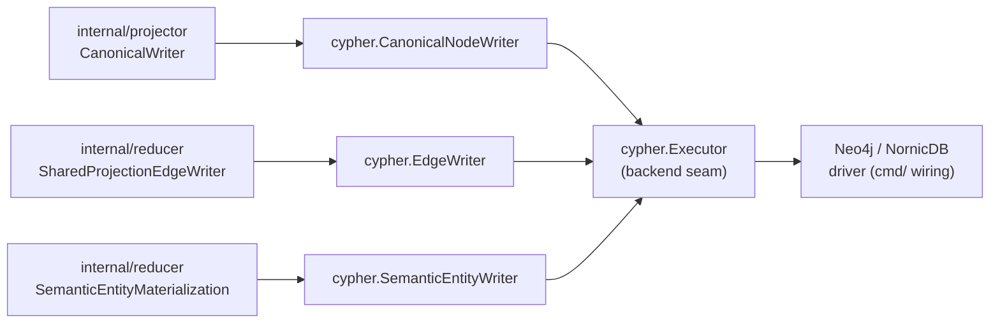
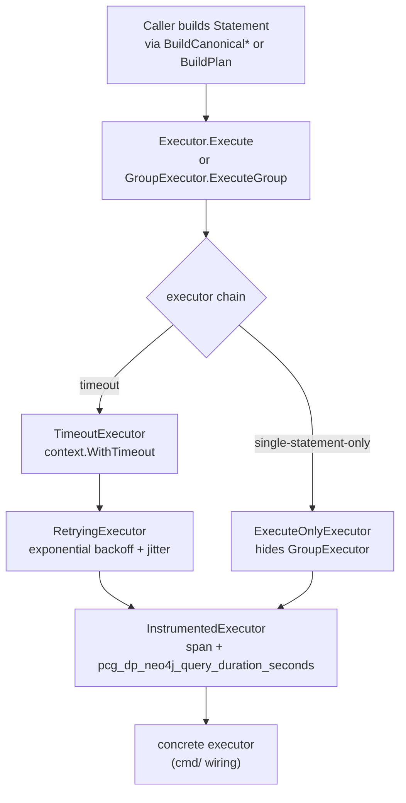

# storage/cypher

`storage/cypher` owns backend-neutral Cypher write contracts, canonical writers,
edge helpers, statement metadata, retry/timeout wrappers, and write
instrumentation for PCG's canonical graph. Every write path that touches the
graph backend goes through this package.

## Where this fits in the pipeline

## Internal flow

## Lifecycle / workflow

Callers build `Statement` values via statement builder functions
(`BuildCanonicalWorkloadUpsert` and related, `BuildRetractRepoDependencyEdges` and
related, `BuildPlan`) and pass them to a writer
(`CanonicalNodeWriter`, `EdgeWriter`, `SemanticEntityWriter`) or directly to
an `Executor`.

`CanonicalNodeWriter.Write` executes all canonical writes in eight named
phases (`retract`, `repository`, `directories`, `files`, `entities`,
`entity_containment`, `modules`, `structural_edges`). When the executor
implements `GroupExecutor`, all phases are sent in a single atomic transaction.
When it implements `PhaseGroupExecutor`, each phase executes as a bounded
group. Otherwise phases run sequentially.

`EdgeWriter.WriteEdges` maps a `reducer.Domain` to a batched UNWIND Cypher
template and dispatches rows in batches of `BatchSize` (default
`DefaultBatchSize` = 500). Domain-specific sub-batch sizes are available for
`DomainCodeCalls`, `DomainInheritanceEdges`, and `DomainSQLRelationships`.

The executor chain is composed in `cmd/` wiring. A typical production chain
wraps a concrete driver executor with `TimeoutExecutor` → `RetryingExecutor` →
`InstrumentedExecutor`.

`RetryingExecutor` detects transient Neo4j errors (deadlock, lock timeout) and
NornicDB MERGE unique conflicts and retries with exponential backoff and jitter.
It does not retry the group path because `session.ExecuteWrite` already handles
that internally.

## Exported surface

**Core types**

- `Statement` — one executable Cypher statement: `Operation`, `Cypher`,
  `Parameters`
- `Plan` — deterministic write plan for one source-local materialization; built
  by `BuildPlan`
- `Operation` — string constant for write type; defined variants:
  `OperationUpsertNode`, `OperationDeleteNode`, `OperationCanonicalUpsert`
- `Executor` — the backend seam: `Execute(ctx, Statement) error`; every
  concrete backend implements this
- `GroupExecutor` — extension of `Executor` for atomic multi-statement writes
- `PhaseGroupExecutor` — extension for bounded phase-grouped writes
- `Adapter` — source-local record writer that builds and executes a `Plan`

**Executor wrappers** (composable chain links)

- `InstrumentedExecutor` — wraps `Executor` with OTEL span and
  `pcg_dp_neo4j_query_duration_seconds` histogram
- `RetryingExecutor` — wraps `Executor` with exponential backoff/jitter for
  transient Neo4j and NornicDB errors
- `TimeoutExecutor` — bounds individual statements with a child context;
  returns `GraphWriteTimeoutError` on deadline
- `ExecuteOnlyExecutor` — hides `GroupExecutor` from callers that must not use
  large atomic groups

**Canonical writers**

- `CanonicalNodeWriter` — writes `projector.CanonicalMaterialization` in strict
  phase order; constructed with `NewCanonicalNodeWriter`; configure per-label
  batch sizes via `WithEntityLabelBatchSize` and containment mode via
  `WithEntityContainmentInEntityUpsert`
- `EdgeWriter` — writes shared-domain edge rows for
  `reducer.SharedProjectionEdgeWriter`; constructed with `NewEdgeWriter`
- `SemanticEntityWriter` — writes semantic entity (Annotation, Module, etc.)
  nodes; five constructors select the Cypher row shape

**Statement builders**

- `BuildPlan(materialization)` — converts a `graph.Materialization` to a
  source-local `Plan`
- `BuildCanonical*Upsert` functions — construct `Statement` values for canonical
  domain nodes: `BuildCanonicalWorkloadUpsert`,
  `BuildCanonicalWorkloadInstanceUpsert`, `BuildCanonicalRuntimePlatformUpsert`,
  `BuildCanonicalInfrastructurePlatformUpsert`,
  `BuildCanonicalDeploymentSourceUpsert`, `BuildCanonicalRepoDependencyUpsert`,
  `BuildCanonicalWorkloadDependencyUpsert`, `BuildCanonicalCodeCallUpsert`,
  `BuildCanonicalRepoRelationshipUpsert`, `BuildCanonicalRunsOnUpsert`
- Statement retraction builders — produce edge and node retraction statements:
  `BuildRetractInfrastructurePlatformEdges`, `BuildRetractRepoDependencyEdges`,
  `BuildRetractWorkloadDependencyEdges`, `BuildRetractCodeCallEdges`,
  `BuildRetractInheritanceEdges`, `BuildRetractSQLRelationshipEdges`,
  `BuildRetractSQLRelationshipEdgeStatements`, `BuildDeleteOrphanPlatformNodes`

**Read / check**

- `CypherReader` — interface for read-only existence queries
- `CanonicalNodeChecker` — short-circuit guard built from `CypherReader`;
  `HasCanonicalCodeTargets` avoids expensive label-free MATCH scans when no
  canonical code nodes exist

**Errors**

- `GraphWriteTimeoutError` — emitted by `TimeoutExecutor`; implements
  `Retryable() bool` and `FailureClass() string`
- `WrapRetryableNeo4jError(err)` — wraps transient errors for the edge writer

## Dependencies

- `internal/graph` — `graph.Materialization`, `graph.Record`, `graph.Result`
  for source-local plan building
- `internal/projector` — `projector.CanonicalMaterialization` and row types
  consumed by `CanonicalNodeWriter`
- `internal/reducer` — `reducer.Domain` constants and
  `reducer.SharedProjectionIntentRow` consumed by `EdgeWriter`
- `internal/telemetry` — `telemetry.Instruments`, span and attribute helpers

Concrete Neo4j/NornicDB driver adapters live in `cmd/` wiring packages, not in
this package. This package owns the backend-neutral writer contracts; `cmd/`
owns the wiring. NornicDB owns the promoted runtime path. Any additional
Cypher/Bolt backend must run these shared statements or use a small, documented
adapter seam.

## Telemetry

- `pcg_dp_neo4j_query_duration_seconds` — histogram per statement;
  `operation=write` or `operation=write_group`
- `pcg_dp_neo4j_batch_size` — batch row count per `UNWIND` statement; grouped
  Neo4j/Bolt execution records one point per statement with bounded
  `operation`, `write_phase`, and `node_type` labels when metadata is present
- `pcg_dp_neo4j_batches_executed_total` — counter labeled by `operation` plus
  bounded statement metadata when available
- `pcg_dp_neo4j_deadlock_retries_total` — counter in `RetryingExecutor` labeled
  by `write_phase`
- `pcg_dp_canonical_atomic_writes_total` / `pcg_dp_canonical_atomic_fallbacks_total`
  — whether `CanonicalNodeWriter` used the group or sequential path
- `pcg_dp_canonical_phase_duration_seconds` — labeled by phase name
- `pcg_dp_canonical_projection_duration_seconds` / `pcg_dp_canonical_retract_duration_seconds`
  — canonical write and retract totals
- `pcg_dp_shared_edge_write_groups_total` / `pcg_dp_shared_edge_write_group_duration_seconds`
  / `pcg_dp_shared_edge_write_group_statement_count` — edge writer group metrics
- `pcg_dp_code_call_edge_batches_total` / `pcg_dp_code_call_edge_batch_duration_seconds`
  — code-call-specific edge metrics
- Spans: `neo4j.execute` and `neo4j.execute_group` from `InstrumentedExecutor`

## Operational notes

- `pcg_dp_neo4j_deadlock_retries_total` rising signals concurrent MERGE
  contention on shared nodes (Repository, Directory, Module); check worker
  concurrency before raising `RetryingExecutor.MaxRetries`.
- `pcg_dp_canonical_atomic_fallbacks_total` > 0 means the executor does not
  implement `GroupExecutor`; write ordering relies on sequential phase execution
  which is slower and non-atomic.
- `pcg_dp_canonical_phase_duration_seconds{phase="retract"}` elevated for
  non-first generations indicates stale node volume; inspect retract batch sizes
  and generation freshness.
- `GraphWriteTimeoutError` surfaces as `failure_class=graph_write_timeout` in
  projector/reducer queue rows; the `TimeoutHint` field names the env var to
  tune.

## Extension points

- `Executor` — implement this interface for any new graph backend; no changes
  to writers or callers are needed
- `GroupExecutor` / `PhaseGroupExecutor` — optional extensions; writers detect
  them at runtime and prefer the grouped path
- `CanonicalNodeWriter` builder options — `WithFileBatchSize`,
  `WithEntityBatchSize`, `WithEntityLabelBatchSize`,
  `WithEntityContainmentInEntityUpsert`,
  `WithBatchedEntityContainmentInEntityUpsert` — tune per-backend without
  branching callers
- New statement builders — add a `BuildCanonicalWorkloadUpsert`-style function
  or a `BuildRetractRepoDependencyEdges`-style function for each new canonical
  domain node or edge type; no writer changes needed

## Gotchas / invariants

- All writes must be idempotent (`doc.go`). `MERGE`-based Cypher and
  `ON CONFLICT DO NOTHING` patterns enforce this; do not replace MERGE with
  CREATE.
- `OperationCanonicalUpsert` is for canonical domain nodes (workloads, files,
  entities). `OperationUpsertNode` / `OperationDeleteNode` are for
  source-local `SourceLocalRecord` writes. Do not mix them.
- `CanonicalNodeWriter` phase order is strict: parent nodes (Repository,
  Directory) must exist before child nodes (File, Entity) because later phases
  use MATCH on these nodes. `directories` are sorted by `Depth` ascending
  (`canonical_node_writer_phases.go`).
- `RetryingExecutor.ExecuteGroup` does not retry; the inner `ExecuteWrite`
  session call already handles transient errors for the group path
  (`retrying_executor.go:87`).
- `ExecuteOnlyExecutor` intentionally hides `GroupExecutor`. Use it when the
  caller must not hold a large atomic transaction (e.g., during source-local
  ingestion that runs concurrently with canonical projection).
- `isNornicDBMergeUniqueConflict` treats commit-time unique constraint
  violations on MERGE Cypher as retryable because a concurrent writer may have
  created the intended node between match and commit (`retrying_executor.go:129`).
- Backend dialect differences (Cypher syntax, transaction shape, constraint
  behavior) belong in documented seams here or in `cmd/` wiring. Do not add
  product-specific branches in callers, and do not create a separate writer
  stream for Neo4j unless a future ADR explicitly rejects the shared contract.

## Related docs

- `docs/docs/architecture.md` — pipeline and ownership table
- `docs/docs/reference/telemetry/index.md` — metric and span reference
- `docs/docs/adrs/2026-04-22-nornicdb-graph-backend-candidate.md`
- `docs/docs/adrs/2026-04-17-neo4j-deadlock-elimination-batch-isolation.md`
- `go/internal/projector/README.md` — how `CanonicalNodeWriter` is wired
