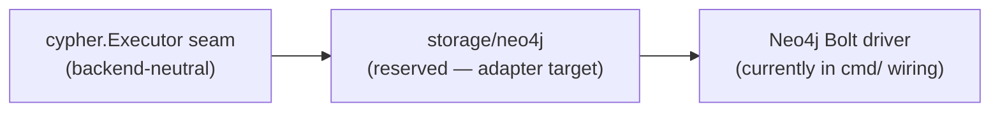

# storage/neo4j

`storage/neo4j` is a reserved package for Neo4j-specific graph storage adapters.
It currently contains only `doc.go`. The Bolt driver and session adapters that
implement the `cypher.Executor` seam live in `cmd/` wiring packages while the
storage boundary is being narrowed.

## Where this fits in the pipeline

## Current state

The package declares the `neo4j` package name in `doc.go` and its intended
purpose. No exported types, functions, or variables are present.

Concrete Neo4j Bolt session adapters live in `cmd/ingester/wiring_neo4j_executor.go`
and `cmd/reducer/neo4j_wiring.go`. Those files implement the `cypher.Executor`
and `cypher.GroupExecutor` seams against the `neo4j-go-driver/v5` Bolt driver.
When the adapter boundary narrows, those implementations will move here.

The backend-neutral write contracts (`cypher.Executor`, `cypher.Statement`,
`cypher.Plan`, writers, statement builders) all live in `internal/storage/cypher`
and will not move here.

## No exported surface

This package exports nothing. Do not import it from `internal/` packages.

## Dependencies

None at present. Future adapters will import the Neo4j Go driver and
`internal/storage/cypher`.

## Telemetry

No direct telemetry today. Neo4j driver metrics are recorded by
`cypher.InstrumentedExecutor` (`pcg_dp_neo4j_query_duration_seconds`,
`pcg_dp_neo4j_batch_size`, `pcg_dp_neo4j_batches_executed_total`) which wraps
whatever executor is passed in, whether it lives here or in `cmd/`.

## Operational notes

Neo4j is the default graph backend (env var PCG_GRAPH_BACKEND=neo4j). Bolt
driver session wiring in `cmd/ingester` and `cmd/reducer` controls connection
pool size, database name, and transaction timeout. When adapter code moves here,
those knobs will surface from this package.

## Extension points

When narrowing the adapter boundary:

- Implement the `cypher.Executor` interface and optionally `cypher.GroupExecutor`
  and `cypher.PhaseGroupExecutor` here.
- Do not duplicate statement building — that belongs in `internal/storage/cypher`.
- Do not import this package from `internal/` packages (projector, reducer,
  query). Only `cmd/` wiring touches Neo4j drivers.

## Related docs

- `go/internal/storage/cypher/README.md` — the backend-neutral contract that
  this package's future adapters will implement
- `docs/docs/architecture.md` — backend selection and PCG_GRAPH_BACKEND
- `docs/docs/adrs/2026-04-22-nornicdb-graph-backend-candidate.md`
- `docs/docs/adrs/2026-04-20-embedded-local-backends-implementation-plan.md`
