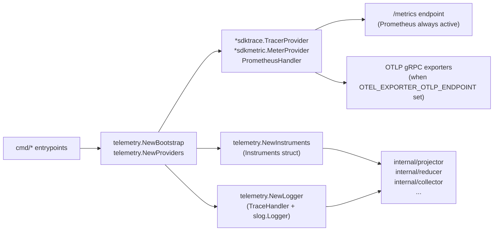

# Telemetry

## Purpose

`telemetry` owns PCG's OpenTelemetry contract: metric instruments, span names,
structured log keys, pipeline phase constants, attribute helpers, OTEL provider
initialization, and the trace-injecting `slog` handler. Every runtime-affecting
package in the data plane imports this package and nothing imports it back.

## Ownership boundary

This package is the single source of truth for all `pcg_dp_*` metric names, all
span name constants (`SpanCollectorObserve`, `SpanProjectorRun`, etc.), and all
log key constants (`LogKeyScopeID`, `LogKeyFailureClass`, etc.). New names are
registered here before being used anywhere else. It does not own queue workers,
graph writers, or HTTP handlers — it only defines the naming contract and the
bootstrapping seams those packages call at startup.

See `CLAUDE.md` §Observability Contract for the project-wide rules that flow
from this package.

## Where this fits in the runtime

## Exported surface

See `doc.go` for the godoc contract. Key groups:

### Bootstrap and providers

- `Bootstrap` — minimum OTEL runtime settings (service name, namespace, meter
  name, tracer name, logger name); built by `NewBootstrap`
- `Providers` — holds `*sdktrace.TracerProvider`, `*sdkmetric.MeterProvider`,
  `PrometheusHandler`, and a combined `Shutdown` function; created by
  `NewProviders`
- `NewProviders` — configures OTLP gRPC trace and metric exporters when
  OTEL_EXPORTER_OTLP_ENDPOINT is set; always creates a Prometheus exporter
- `RecordGOMEMLIMIT` — registers `pcg_dp_gomemlimit_bytes` as an observable
  gauge at startup

### Metric instruments

`Instruments` holds all pre-registered OTEL metric instruments. Create with
`NewInstruments(meter)`. Observable gauges require a separate
`RegisterObservableGauges` call once the queue and worker observers are wired.
`RegisterAcceptanceObservableGauges` adds the `pcg_dp_shared_acceptance_rows`
gauge when a shared-acceptance observer is available.

#### Counters (Int64)

| Field | Metric name |
| --- | --- |
| `FactsEmitted` | `pcg_dp_facts_emitted_total` |
| `FactsCommitted` | `pcg_dp_facts_committed_total` |
| `ProjectionsCompleted` | `pcg_dp_projections_completed_total` |
| `ReducerIntentsEnqueued` | `pcg_dp_reducer_intents_enqueued_total` |
| `ReducerExecutions` | `pcg_dp_reducer_executions_total` |
| `CanonicalWrites` | `pcg_dp_canonical_writes_total` |
| `CanonicalNodesWritten` | `pcg_dp_canonical_nodes_written_total` |
| `CanonicalEdgesWritten` | `pcg_dp_canonical_edges_written_total` |
| `CanonicalAtomicWrites` | `pcg_dp_canonical_atomic_writes_total` |
| `CanonicalAtomicFallbacks` | `pcg_dp_canonical_atomic_fallbacks_total` |
| `SharedProjectionCycles` | `pcg_dp_shared_projection_cycles_total` |
| `SharedProjectionStaleIntents` | `pcg_dp_shared_projection_stale_intents_total` |
| `SharedAcceptanceUpserts` | `pcg_dp_shared_acceptance_upserts_total` |
| `SharedAcceptanceLookupErrors` | `pcg_dp_shared_acceptance_lookup_errors_total` |
| `SharedEdgeWriteGroups` | `pcg_dp_shared_edge_write_groups_total` |
| `CodeCallEdgeBatches` | `pcg_dp_code_call_edge_batches_total` |
| `Neo4jBatchesExecuted` | `pcg_dp_neo4j_batches_executed_total` |
| `Neo4jDeadlockRetries` | `pcg_dp_neo4j_deadlock_retries_total` |
| `ReposSnapshotted` | `pcg_dp_repos_snapshotted_total` |
| `FilesParsed` | `pcg_dp_files_parsed_total` |
| `FactBatchesCommitted` | `pcg_dp_fact_batches_committed_total` |
| `ContentReReads` | `pcg_dp_content_rereads_total` |
| `ContentReReadSkips` | `pcg_dp_content_reread_skips_total` |
| `DiscoveryDirsSkipped` | `pcg_dp_discovery_dirs_skipped_total` |
| `DiscoveryFilesSkipped` | `pcg_dp_discovery_files_skipped_total` |
| `LargeRepoClassifications` | `pcg_dp_large_repo_classifications_total` |
| `EvidenceFactsDiscovered` | `pcg_dp_evidence_facts_discovered_total` |
| `DeferredBackfillEvidence` | `pcg_dp_deferred_backfill_evidence_total` |
| `DeploymentMappingReopened` | `pcg_dp_deployment_mapping_reopened_total` |
| `IaCReachabilityRows` | `pcg_dp_iac_reachability_rows_total` |
| `CrossRepoEvidenceLoaded` | `pcg_dp_cross_repo_evidence_loaded_total` |
| `CrossRepoEdgesResolved` | `pcg_dp_cross_repo_edges_resolved_total` |

#### Histograms (Float64 unless noted)

| Field | Metric name | Custom buckets |
| --- | --- | --- |
| `CollectorObserveDuration` | `pcg_dp_collector_observe_duration_seconds` | 0.01–60 s |
| `ScopeAssignDuration` | `pcg_dp_scope_assign_duration_seconds` | default |
| `FactEmitDuration` | `pcg_dp_fact_emit_duration_seconds` | default |
| `ProjectorRunDuration` | `pcg_dp_projector_run_duration_seconds` | 0.1–120 s |
| `ProjectorStageDuration` | `pcg_dp_projector_stage_duration_seconds` | default |
| `ReducerRunDuration` | `pcg_dp_reducer_run_duration_seconds` | default |
| `ReducerQueueWaitDuration` | `pcg_dp_reducer_queue_wait_seconds` | 0.001–21600 s |
| `CanonicalWriteDuration` | `pcg_dp_canonical_write_duration_seconds` | 0.01–60 s |
| `CanonicalProjectionDuration` | `pcg_dp_canonical_projection_duration_seconds` | 0.01–60 s |
| `CanonicalRetractDuration` | `pcg_dp_canonical_retract_duration_seconds` | 0.001–2.5 s |
| `CanonicalBatchSize` | `pcg_dp_canonical_batch_size` | 1–1000 rows |
| `CanonicalPhaseDuration` | `pcg_dp_canonical_phase_duration_seconds` | 0.001–5 s |
| `QueueClaimDuration` | `pcg_dp_queue_claim_duration_seconds` | default |
| `PostgresQueryDuration` | `pcg_dp_postgres_query_duration_seconds` | 0.001–2.5 s |
| `Neo4jQueryDuration` | `pcg_dp_neo4j_query_duration_seconds` | 0.001–10 s |
| `Neo4jBatchSize` | `pcg_dp_neo4j_batch_size` | 1–1000 rows |
| `SharedAcceptanceUpsertDuration` | `pcg_dp_shared_acceptance_upsert_duration_seconds` | default |
| `SharedAcceptanceLookupDuration` | `pcg_dp_shared_acceptance_lookup_duration_seconds` | default |
| `SharedAcceptancePrefetchSize` | `pcg_dp_shared_acceptance_prefetch_size` (Int64) | 1–512 rows |
| `SharedProjectionIntentWaitDuration` | `pcg_dp_shared_projection_intent_wait_seconds` | 0.001–21600 s |
| `SharedProjectionProcessingDuration` | `pcg_dp_shared_projection_processing_seconds` | 0.001–60 s |
| `SharedProjectionStepDuration` | `pcg_dp_shared_projection_step_seconds` | 0.001–60 s |
| `SharedEdgeWriteGroupDuration` | `pcg_dp_shared_edge_write_group_duration_seconds` | 0.001–60 s |
| `SharedEdgeWriteGroupStatementCount` | `pcg_dp_shared_edge_write_group_statement_count` (Int64) | 1–128 stmts |
| `CodeCallEdgeDuration` | `pcg_dp_code_call_edge_batch_duration_seconds` | 0.001–5 s |
| `BatchClaimSize` | `pcg_dp_reducer_batch_claim_size` (Int64) | 1–128 items |
| `RepoSnapshotDuration` | `pcg_dp_repo_snapshot_duration_seconds` | 0.1–300 s |
| `FileParseDuration` | `pcg_dp_file_parse_duration_seconds` | 0.001–2.5 s |
| `GenerationFactCount` | `pcg_dp_generation_fact_count` | 10–300000 facts |
| `LargeRepoSemaphoreWait` | `pcg_dp_large_repo_semaphore_wait_seconds` | 0–300 s |
| `DeferredBackfillDuration` | `pcg_dp_deferred_backfill_duration_seconds` | 0.1–300 s |
| `IaCReachabilityMaterializationDuration` | `pcg_dp_iac_reachability_materialization_duration_seconds` | 0.1–300 s |
| `CrossRepoResolutionDuration` | `pcg_dp_cross_repo_resolution_duration_seconds` | 0.01–30 s |
| `PipelineOverlapDuration` | `pcg_dp_pipeline_overlap_seconds` | 1–1800 s |

#### Observable gauges

| Field | Metric name | Dimensions |
| --- | --- | --- |
| `QueueDepth` | `pcg_dp_queue_depth` | `queue`, `status` |
| `QueueOldestAge` | `pcg_dp_queue_oldest_age_seconds` | `queue` |
| `WorkerPoolActive` | `pcg_dp_worker_pool_active` | `pool` |
| `SharedAcceptanceRows` | `pcg_dp_shared_acceptance_rows` | none |
| (via `RecordGOMEMLIMIT`) | `pcg_dp_gomemlimit_bytes` | none |

### Span name constants

Defined in `contract.go`. Use `telemetry.SpanXxx` rather than string literals.

Pipeline spans: `SpanCollectorObserve`, `SpanCollectorStream`, `SpanScopeAssign`,
`SpanFactEmit`, `SpanProjectorRun`, `SpanReducerIntentEnqueue`, `SpanReducerRun`,
`SpanReducerBatchClaim`, `SpanCanonicalWrite`, `SpanCanonicalProjection`,
`SpanCanonicalRetract`, `SpanEvidenceDiscovery`,
`SpanIaCReachabilityMaterialization`, `SpanSQLRelationshipMaterialization`,
`SpanInheritanceMaterialization`, `SpanCrossRepoResolution`,
`SpanSharedAcceptanceLookup`, `SpanSharedAcceptanceUpsert`,
`SpanQueryRelationshipEvidence`, `SpanQueryDeadIaC`,
`SpanQueryInfraResourceSearch`.

Dependency spans: `SpanPostgresExec`, `SpanPostgresQuery`, `SpanNeo4jExecute`.

The full frozen list is also accessible at runtime via `SpanNames()`.

### Log keys and phase constants

Log keys (all frozen in `contract.go`): `LogKeyScopeID`, `LogKeyScopeKind`,
`LogKeySourceSystem`, `LogKeyGenerationID`, `LogKeyCollectorKind`,
`LogKeyDomain`, `LogKeyPartitionKey`, `LogKeyRequestID`, `LogKeyFailureClass`,
`LogKeyRefreshSkipped`, `LogKeyPipelinePhase`, `LogKeyAcceptanceScopeID`,
`LogKeyAcceptanceUnitID`, `LogKeyAcceptanceSourceRunID`,
`LogKeyAcceptanceGenerationID`, `LogKeyAcceptanceStaleCount`.

Pipeline phase constants (defined in `logging.go`): `PhaseDiscovery`,
`PhaseParsing`, `PhaseEmission`, `PhaseProjection`, `PhaseReduction`,
`PhaseShared`, `PhaseQuery`, `PhaseServe`.

### Attribute and log helpers

Attribute helpers — typed constructors for every metric dimension key, for
example `AttrDomain`, `AttrScopeID`, `AttrWritePhase`; use these rather than
`attribute.String` literals when recording metrics.

`ScopeAttrs`, `DomainAttrs`, `AcceptanceAttrs` — return `[]slog.Attr` slices
for the common scope, domain, and acceptance-context log fields.

`PhaseAttr`, `FailureClassAttr`, `AcceptanceStaleCountAttr`, `EventAttr` —
single-key `slog.Attr` constructors for the most frequently repeated log fields.

### Logging

`NewLogger` and `NewLoggerWithWriter` — construct a JSON `slog.Logger` backed
by `TraceHandler`. The handler injects `trace_id`, `span_id`, and
`severity_number` from the active OTEL span context on every record. Base
attributes `service_name`, `service_namespace`, `component`, and `runtime_role`
are attached at logger creation.

### Refresh counter

`RecordSkippedRefresh`, `SkippedRefreshCount` — process-local atomic counter for
incremental-refresh skip tracking. Not a metric; used only for status-surface
reporting.

## Dependencies

No internal PCG package imports. External dependencies:

- `go.opentelemetry.io/otel/{metric,trace}` — OTEL API
- `go.opentelemetry.io/otel/sdk/{metric,trace}` — OTEL SDK providers
- `go.opentelemetry.io/otel/exporters/otlp/...grpc` — OTLP gRPC exporters
- `go.opentelemetry.io/otel/exporters/prometheus` — Prometheus bridge
- `github.com/prometheus/client_golang/prometheus` — Prometheus registry

This is a leaf package. Introducing any `go/internal/*` import here creates a
circular dependency and must not happen.

## Telemetry

This package defines the telemetry contract. It emits nothing itself at
runtime; all emission happens in the packages that consume `Instruments`.

## Gotchas / invariants

- `NewInstruments` registers every counter and histogram but does not wire
  observable gauges. Call `RegisterObservableGauges` after the queue and worker
  implementations are ready, otherwise `pcg_dp_queue_depth`,
  `pcg_dp_queue_oldest_age_seconds`, and `pcg_dp_worker_pool_active` will not
  appear on `/metrics`.
- Observable gauges are registered exactly once per process. Calling
  `RegisterObservableGauges` more than once for the same meter produces
  duplicate-instrument errors from the OTEL SDK.
- The Prometheus exporter uses its own `prometheus.NewRegistry()` (not the
  default registry), so it is isolated from any third-party code that
  registers on the default registry.
- `TraceHandler` only injects `trace_id` and `span_id` when a valid span is
  active in the context. Log lines emitted outside any span do not carry trace
  fields; this is expected.
- `RecordGOMEMLIMIT` silently no-ops when `meter` is nil, so callers that have
  not yet initialized OTEL do not crash.
- High-cardinality values — repository paths, fact IDs, work-item IDs — belong
  in spans or log fields, never in metric label values. Metric labels must stay
  bounded.
- All metric names are frozen once registered. Renaming a metric name requires
  coordinating with all dashboards and alert rules; prefer adding a new name
  over renaming.

## Related docs

- `docs/docs/reference/telemetry/index.md` — operator-facing metric, span, and
  log reference with tuning guidance
- `docs/docs/architecture.md` — pipeline ownership table
- `docs/docs/deployment/service-runtimes.md` — how each binary bootstraps OTEL
