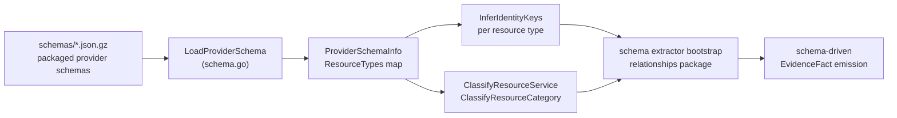
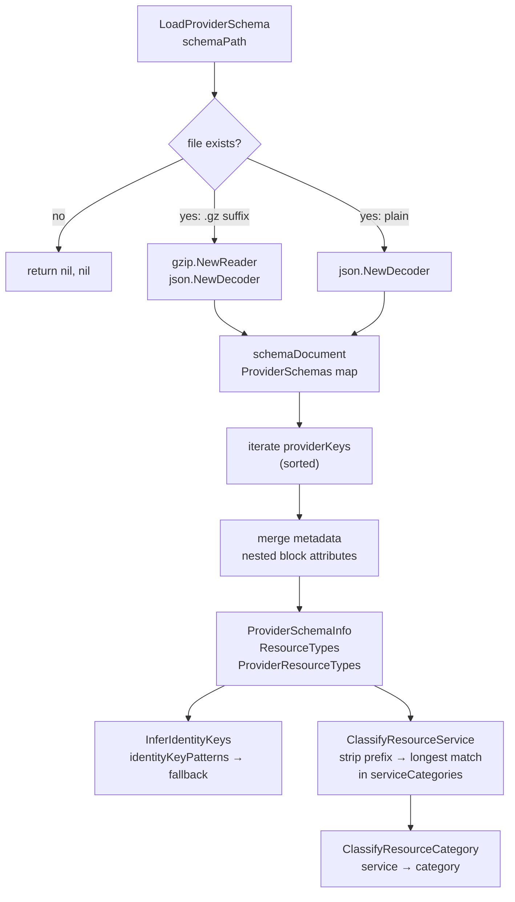

# Terraformschema

## Purpose

`terraformschema` loads packaged Terraform provider schemas and classifies
resource types into PCG-facing service and category labels. It is the
schema data layer that `internal/relationships` uses to bootstrap schema-driven
Terraform extractors, and the source of identity-key inference for stable
resource name matching.

This package owns provider schema parsing, identity-key inference, and the
curated service-to-category table. It never touches the graph, queue, or
reducer directly.

## Where this fits in the pipeline

## Internal flow

## Lifecycle / workflow

`LoadProviderSchema` reads a single provider schema file. If the path ends in
`.gz` it wraps the file in `gzip.NewReader` before decoding; otherwise it
decodes plain JSON. Missing or undecodable files return `(nil, nil)` — callers
must treat nil as "schema unavailable" rather than an error condition.

After decoding, the loader iterates sorted `providerKeys` to produce
deterministic output. For each provider it copies the resource attribute map
and merges any nested block listed in `nestedIdentityBlocks` (currently only
`metadata`) so that Kubernetes-style `metadata.name` lookups resolve at the
top level. The result is a `ProviderSchemaInfo` containing the flat
`ResourceTypes` map and the per-provider `ProviderResourceTypes` map.

`InferIdentityKeys` walks `identityKeyPatterns` in priority order (`name`,
`function_name`, `bucket`, etc.) looking for a string-typed attribute. If none
matches, it falls back to any attribute ending in `_name` or `_identifier`,
sorted for stable output. The returned keys are used by the relationships
package to extract candidate names from Terraform resource blocks.

`ClassifyResourceService` strips the provider prefix from a resource type
(e.g. `aws_rds_cluster` → `rds_cluster`) then performs a longest-prefix match
in the `serviceCategories` table in `categories.go`. `ClassifyResourceCategory`
calls `ClassifyResourceService` and then looks up the resulting service in the
same table to return the broad category string (`compute`, `storage`, `data`,
`networking`, `messaging`, `security`, `cicd`, `monitoring`, `governance`).

`DefaultSchemaDir` resolves the packaged `schemas/` directory relative to
`paths.go` using `runtime.Caller`. An explicit PCG_TERRAFORM_SCHEMA_DIR
environment override wins.

## Exported surface

- `LoadProviderSchema(schemaPath string)` — read and normalize one provider
  schema file; returns `(*ProviderSchemaInfo, error)` where nil means the file
  was absent or unparseable (`schema.go:83`)
- `InferIdentityKeys(attributes)` — infer stable resource identity keys from
  a resource's attribute map; returns `[]string` in priority order
  (`schema.go:138`)
- `ClassifyResourceCategory(resourceType string)` — return the broad
  infrastructure category for a resource type (`schema.go:165`)
- `ClassifyResourceService(resourceType string)` — return the provider service
  family for a resource type, using the longest known category prefix
  (`schema.go:181`)
- `DefaultSchemaDir()` — return the canonical packaged schema directory;
  respects PCG_TERRAFORM_SCHEMA_DIR override (`paths.go:12`)
- `AttributeSchema` — holds the raw JSON type field for one resource attribute
  (`schema.go:41`)
- `ProviderSchemaInfo` — normalized loader output: `ProviderKey`,
  `ProviderName`, `ProviderKeys`, `FormatVersion`, `ResourceTypes`,
  `ProviderResourceTypes`; `ResourceCount()` method returns the total
  resource type count (`schema.go:67`)

## Dependencies

Standard library only: `compress/gzip`, `encoding/json`, `os`, `path/filepath`,
`runtime`, `sort`, `strings`. No PCG-internal packages are imported.

## Telemetry

None. Schema loading is a startup-time operation; callers in
`internal/relationships` own any call-site instrumentation.

## Operational notes

- `LoadProviderSchema` returns `(nil, nil)` — not an error — when the file
  does not exist or fails to decode. Callers must handle nil gracefully. The
  design is intentional: a missing schema is not fatal; it means the resource
  type will produce no schema-driven evidence.
- Gzip detection is by `.gz` suffix only. Files without the suffix are decoded
  as plain JSON regardless of their on-disk encoding. Do not rename gzipped
  schema files to remove the suffix.
- `DefaultSchemaDir` uses `runtime.Caller(0)` to locate the file. This works
  in normal builds but may return an empty string if the binary was built
  without debug symbols in some cross-compilation scenarios. Always provide
  an explicit path via PCG_TERRAFORM_SCHEMA_DIR when running in containers
  that do not embed the source tree.
- Adding a new provider requires generating a fresh schema file with
  `terraform providers schema -json`, gzipping it, and placing it in
  `schemas/`. See `schemas/README.md` and
  `scripts/generate_terraform_provider_schema.sh`.
- `nestedIdentityBlocks` contains only `metadata` today. Adding a new entry
  causes all provider resource types that have that block to have its
  attributes merged into the top-level attribute map. This is a global change;
  verify that no existing identity key inference is disrupted.

## Extension points

- **Add a new provider** → place a `<provider>-<version>.json.gz` in
  `schemas/` and call RegisterSchemaDrivenTerraformExtractors in the
  relationships package. No code changes to this package are needed.
- **Add a new service category mapping** → add entries to `serviceCategories`
  in `categories.go`. Use the longest unambiguous prefix for the resource type
  service part. Run `go test ./internal/terraformschema -count=1`.
- **Add a new identity key pattern** → append to `identityKeyPatterns` in
  `schema.go`. Patterns are tried in order; put higher-confidence patterns
  earlier. Run the identity inference tests to verify no regressions.

## Gotchas / invariants

- `LoadProviderSchema` merges nested block attributes only from blocks listed
  in `nestedIdentityBlocks`. Attributes in other block types (e.g. `timeouts`,
  `tags_all`) are not promoted to the top level.
- `ClassifyResourceService` strips only the first underscore-separated segment
  as the provider prefix. Resource types without an underscore return an empty
  service string and `ClassifyResourceCategory` falls back to
  `"infrastructure"`.
- `ProviderSchemaInfo.ResourceTypes` is a flat merge across all providers in
  the schema file. When two providers define the same resource type string,
  the last-sorted provider's attributes win. In practice, each schema file
  contains exactly one provider.
- The `identityKeyPatterns` fallback to `*_name` / `*_identifier` suffix
  matching is sorted alphabetically for stable test output, not by semantic
  priority. If multiple fallback attributes exist for a resource type, the
  alphabetically first one wins.

## Related docs

- `docs/docs/architecture.md` — ownership table
- `go/internal/terraformschema/schemas/README.md` — schema generation and
  packaging instructions
- `scripts/generate_terraform_provider_schema.sh` — schema generation script
- `scripts/package_terraform_schemas.sh` — gzip packaging script
- `go/internal/relationships/README.md` — consumer of this package
