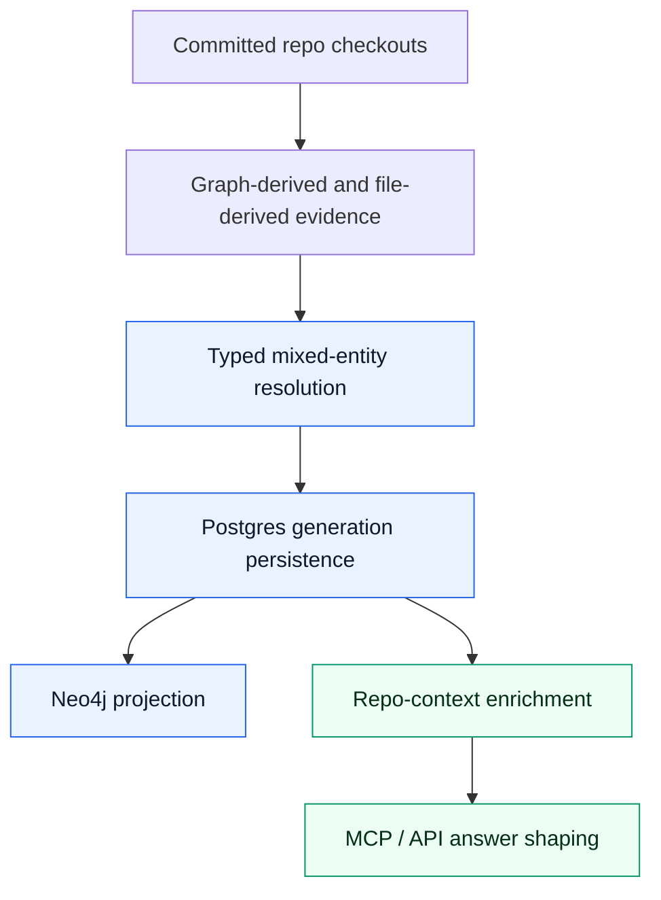

# Relationships Package

This package owns the post-index relationship pipeline: checkout identity, evidence discovery, typed resolution, Postgres persistence, and Neo4j projection.

For the public explanation of the flow and relationship semantics, see [Relationship Mapping](../../../docs/docs/reference/relationship-mapping.md).

## Pipeline

The dynamic mapping flow is ordered:



1. build stable checkout identities for committed repos
2. collect graph-derived and raw file-based evidence
3. resolve evidence plus assertions into canonical relationships
4. persist a generation in Postgres
5. project the active resolved generation into Neo4j
6. feed repo-context enrichment and answer shaping from the resolved data

The package should remain truthful about what is canonical versus what is derived later for presentation.

## Stage Discipline

Keep each stage doing one job:

1. indexing parses and stores graph entities
2. linking resolves repo identity and cross-checkout references
3. evidence extraction emits explainable facts
4. resolution decides canonical meaning and precedence
5. persistence and projection publish the active generation
6. repo-context enrichment adds nearby supporting context
7. MCP/API shaping turns that into a concise narrative

If a change crosses those boundaries, document why. Most bugs in this system come from skipping straight to summary logic or from letting a parser embed provider-specific semantic meaning.

## Module Map

| Module | Responsibility |
| :--- | :--- |
| `models.py` | Dataclasses for checkouts, evidence, candidates, assertions, resolved relationships, and generations |
| `identity.py` | Stable checkout identity helpers |
| `file_evidence.py` | Raw file-based extractors for Terraform, Helm, Kustomize, and ArgoCD |
| `execution.py` | Checkout discovery, graph-derived evidence, and Neo4j projection |
| `resolver.py` | Evidence dedupe, candidate building, assertion application, suppression rules, and end-to-end resolution orchestration |
| `postgres.py` | Read and write APIs for assertions, candidates, generations, and resolved relationships |
| `postgres_generation.py` | Bulk generation persistence helpers |
| `postgres_support.py` | Postgres schema bootstrap for relationship tables |
| `state.py` | Shared relationship store lifecycle |

## Design Rules

### Postgres Is Canonical

Postgres stores:

- evidence facts
- candidates
- assertions and rejections
- resolved generations

Neo4j is the projected read model used by the existing query surfaces.

### Resolution Is Post-Index

Do not correlate repos while indexing is still in flight. Resolve only after the repos in scope are committed and the evidence set is stable.

### Preserve Semantics

Do not flatten every mapping to `DEPENDS_ON`.

Current canonical relationship types:

- `DEPENDS_ON`
- `DISCOVERS_CONFIG_IN`
- `DEPLOYS_FROM`
- `PROVISIONS_DEPENDENCY_FOR`
- `PROVISIONS_PLATFORM`
- `RUNS_ON`

Typed canonical relationships beat the generic compatibility edge. The resolver should suppress the generic `DEPENDS_ON` candidate for the same implied pair, then derive a compatibility `DEPENDS_ON` edge from the typed result unless that generic edge was explicitly rejected.

### Keep Direction Honest

Write the edge from the actor or subject to the source of config, artifacts, or runtime support.

- ArgoCD control plane discovers config in another repo
- deployable workloads deploy from charts or manifests owned by another repo
- Terraform/Terragrunt repos provision dependency resources for downstream workloads

### Deployment Artifacts Are Derived

Deployment artifacts are not the canonical relationship itself. They are the read-side summaries built after resolution so repository context can explain what the source repo deploys from and what related files matter.

That makes them useful for answer shaping, but they should never override the underlying typed edge.

### Story-First MCP Output Is Also Derived

`get_repo_summary` and `trace_deployment_chain` now expose a top-level `story` field. It is a presentation contract, not canonical relationship storage.

Rules:

1. build `story` from canonical relationships plus derived summaries
2. prefer `topology_story`, then `deployment_story`, then notes
3. do not put a fact in `story` unless the lower layers can already explain it
4. keep the raw evidence-heavy fields intact for drill-down

## Terraform Runtime Extension Rules

When Terraform or Terragrunt module blocks carry deployment-oriented metadata, keep the parser contract generic so it can support more than one runtime family.

Current `TerraformModule` deployment attributes include:

- `deployment_name`
- `repo_name`
- `create_deploy`
- `cluster_name`
- `zone_id`
- `deploy_entry_point`

These fields are currently useful for ECS-oriented summaries, but they are deliberately not named as ECS-only fields. The goal is to let future contributors extend the same flow for Fargate, Elastic Beanstalk, or another cloud/provider runtime without introducing a second parser contract.

Runtime-family matching should stay centralized. Terraform resource types and module source patterns that identify one runtime family belong in the shared Terraform runtime-family registry, not in scattered ECS-only or EKS-only conditionals.

Rules:

1. add new Terraform module attributes only when they describe a portable deployment concept
2. keep provider- or runtime-specific interpretation in resolver or read-side summary code, not in the parser itself
3. document each new attribute in the public mapping reference and the prompt schema
4. add tests that prove the attribute is parsed, persisted, and surfaced through repo-context summaries

Treat ECS as the first example of this extension pattern, not the only intended consumer.

### Runtime Expansion Order

For Terraform-managed runtimes such as ECS today and Fargate or Elastic Beanstalk later:

1. extend the shared runtime-family registry when the runtime needs new family signals
2. add or reuse generic module attributes
3. resolve `Platform` identity and typed edges
4. enrich repo context with deployment artifacts and runtime summaries
5. update the MCP `story` only after the typed and derived layers are correct

Do not skip directly from parser fields to user-facing prose.

## Where To Add New Mappings

### Raw File Mappings

If the source of truth is checked-in config, add a focused extractor to `file_evidence.py` and call it from the file-evidence discovery path.

Use this path for:

- Terraform or Terragrunt configuration
- Helm chart metadata and values
- Kustomize resources and image references
- ArgoCD ApplicationSets
- GitHub Actions and Jenkins/Groovy delivery-path hints when the repo link is explicit enough to be explainable

### Graph-Derived Mappings

If the signal already exists in the graph and is trustworthy, extend the graph-derived evidence path in `execution.py`.

### Resolver Behavior

If a new typed relationship needs precedence or conflict rules, change `resolver.py` and add tests that prove the intended suppression or coexistence behavior.

### Repo Context Enrichment

If the new mapping should influence deployment-artifact summaries or delivery-path answers, update the repository context enrichment helpers so the derived data stays consistent with the canonical edge.

## Checklist For A New Mapping

1. Pick the right relationship type before writing extraction code.
2. Emit a stable `evidence_kind`.
3. Include explainable details with path, matched value, extractor name, and tool context.
4. Add OTEL spans around the extractor or evidence source.
5. Emit JSON logs with stable `event_name` values and mapping counts under `extra_keys`.
6. Add positive and negative tests.
7. Validate the mapping on a mixed local corpus, not just a synthetic one-repo fixture.
8. Decide explicitly whether the new mapping should emit `DISCOVERS_CONFIG_IN`, `DEPLOYS_FROM`, `RUNS_ON`, or a generic fallback.
9. Decide whether the new mapping should influence `story`, `deployment_overview`, or neither.
10. Document the extension path if the new mapping introduces a reusable runtime pattern.

## Choosing The Next Type

Use this quick rule of thumb when adding support for more tools:

- choose `DISCOVERS_CONFIG_IN` when the source watches or scans another repo for config
- choose `DEPLOYS_FROM` when the source repo or deployable subject is deployed from artifacts, manifests, charts, or overlays owned by another repo
- choose `PROVISIONS_PLATFORM` when the source creates the runtime platform itself
- choose `RUNS_ON` when the source workload runs on that platform
- choose `PROVISIONS_DEPENDENCY_FOR` when the source creates infra the target needs but does not deploy the target
- choose `DEPENDS_ON` only when none of the above is precise enough yet

## Platform Modeling In This Slice

The Postgres relationship resolver is now mixed-entity. Canonical rows can point at repository ids or platform entity ids through `source_entity_id` and `target_entity_id`, while still carrying repository ids when those are known.

That means:

- repository and platform relationships both resolve canonically before projection
- `PROVISIONS_PLATFORM` and `RUNS_ON` are not query-only hints anymore
- compatibility `DEPENDS_ON` edges can be derived from typed platform chains
- query-layer repository summaries still add read-side context like deployment artifacts, consumer-only repositories, and shared-config-path summaries on top of the canonical relationships

## Observability Requirements

Relationship code uses the shared observability subsystem under `observability/`.

Rules:

- stdout JSON is the canonical log format
- keep custom dimensions under `extra_keys`
- use stable machine-readable `event_name` values
- start OTEL spans around extractor families and the overall resolve/projection stages
- keep trace and log correlation fields intact with `run_id`, `generation_id`, and `scope`

Useful existing events:

- `relationships.discover_file_evidence.completed`
- `relationships.discover_gitops_evidence.completed`
- `relationships.discover_evidence.completed`
- `relationships.persist_generation.completed`
- `relationships.project.completed`
- `relationships.resolve.completed`
- `relationships.resolve.failed`

Useful existing span names:

- `pcg.relationships.discover_evidence`
- `pcg.relationships.discover_evidence.file`
- `pcg.relationships.discover_evidence.terraform`
- `pcg.relationships.discover_evidence.helm`
- `pcg.relationships.discover_evidence.kustomize`
- `pcg.relationships.discover_evidence.gitops`
- `pcg.relationships.discover_evidence.argocd`
- `pcg.relationships.resolve_repository_dependencies`
- `pcg.relationships.project`

## Verification Expectations

Before trusting a new mapping, run:

- focused unit tests for evidence extraction
- focused unit tests for resolver precedence and projection behavior
- a mixed-corpus validation when the family changes answer shape

The main relationship test files are:

- `tests/unit/relationships/test_file_evidence.py`
- `tests/unit/relationships/test_resolver.py`

If the new mapping changes repo-context enrichment, also check the query-side summaries that consume `deploys_from` and `discovers_config_in`.

If the new mapping changes MCP answer shape, also verify:

- the top-level `story` stays concise
- lower-level evidence remains available
- completeness notes still surface when data is partial

## Current Example

ArgoCD repo discovery is modeled as:

```text
iac-eks-argocd -[:DISCOVERS_CONFIG_IN]-> iac-eks-observability
api-node-bw-home -[:DEPLOYS_FROM]-> helm-charts
```

Those edges mean the ArgoCD repo discovers deployment config in the target repo, while the deployed service sources manifests or charts from another repo. They are intentionally not flattened into a generic `DEPENDS_ON`.
